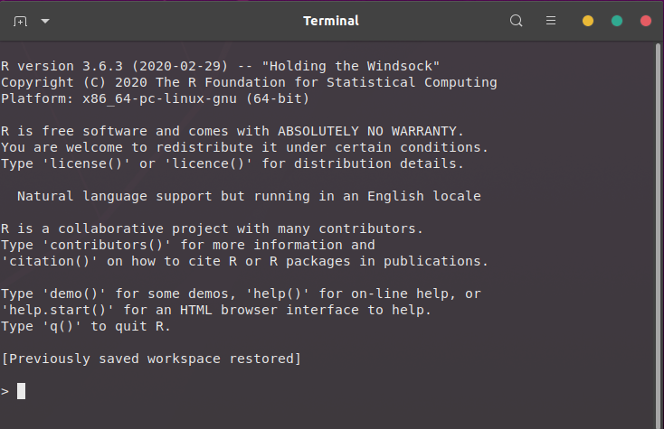
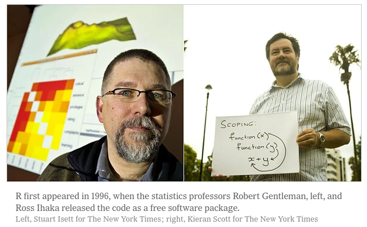
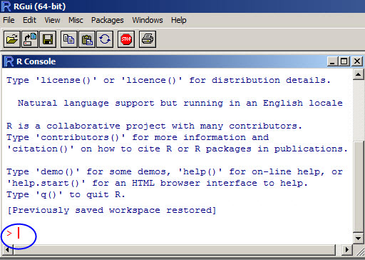
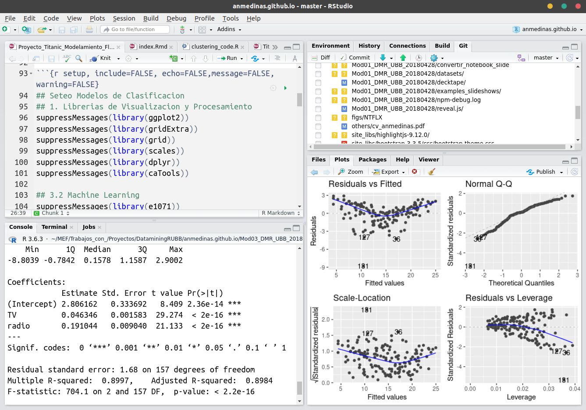
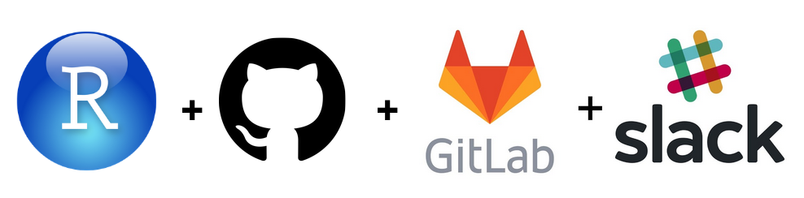
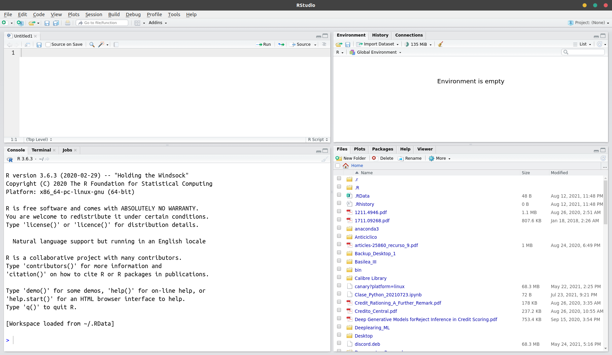
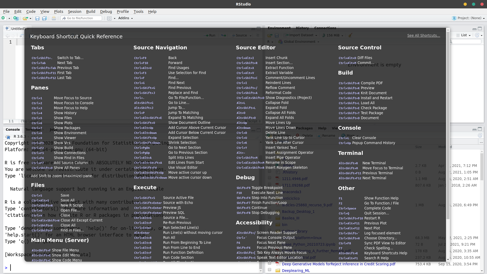

---
title       : Programación en R.
subtitle    : Módulo 01 - Ambiente de Programación.
framework   : io2012        # {io2012, html5slides, shower, dzslides, ...}
highlighter : highlight.js  # {highlight.js, prettify, highlight}
hitheme     : github      # tomorrow
widgets     : [mathjax, quiz, bootstrap, interactive] # {mathjax, quiz, bootstrap}
ext_widgets : {rCharts: [libraries/nvd3, libraries/leaflet, libraries/dygraphs]}
mode        : selfcontained # {standalone, draft}
knit        : slidify::knit2slides
logo        : 
biglogo     : Rlogo.png
assets      : {assets: ../../assets}
--- .class #id

<!-- Slide 01 -->

## Agenda del Curso
> * **Módulo 1: Introducción a la programación en R.**
  <ol>
    <ul style="list-style-type:square">
    <li> Ambiente de programación. </li> 
    <li> Tipos de datos y estructuras de datos básicos. </li>
    <li> Control de flujo y funciones. </li>
    </ul>
  </ol> 

> * **Módulo 2: Manejo de datos estructurados.**
  <ol>
    <ul style="list-style-type:square">
    <li> Operaciones sobre dataframes. </li>
    <li> Joins y funciones estadísticas. </li>
    </ul>
  </ol> 

> * **Módulo 3: Importar y exportar archivos de datos.**
  <ol>
    <ul style="list-style-type:square">
    <li> Importar y exportar archivos de datos. </li>
    <li> Conexión a bases de datos SQL. </li>
    </ul>
  </ol> 

> * **Módulo 4: Visualización de datos.**
 <ol>
    <ul style="list-style-type:square">
    <li> Librería ggplot2 y elementos estéticos de gráficos. </li>
    </ul>
  </ol> 

<!-- Slide 02 -->

--- .segue bg:grey

# Módulo 1: Ambiente de programación.

--- &twocol

<!-- Slide 03 -->
## R es ...
*** =left

> * *... un lenguaje de programación.*

> * *... especializado en estadística.*

> * *... software libre con licencia GNU LGPL.*

> * *... multiplataforma.*

> * *... demasiada documentación.*

> * *... lenguaje de programación en línea de comandos.*

</img>

*** =right
</img>

</img>
*** =fullwidth

--- &twocol

<!-- Slide 05 -->
## Ventajas de Rstudio ...

*** =left
> * *... Entorno de desarrollo integrado (IDE) programada en C#*.

> * *... libre y multiplaforma*.

> * *... muestra workspace e historial de comandos*.

> * *... integra visor de paquetes instalados y/o cargados*.

> * *... abrir varios scripts a la vez*.

> * *... depurador de códigos (breakpoints)*.

> * *... trabajar con proyectos*.

> * *... presentaciones con HTML5*.

> * *... etc ... etc .. etc ...*.

*** =right

</img>

</img>

*** =fullwidth

--- .class #id

<!-- Slide 05 -->
## Screenshot de Rstudio

</img>

--- .class #id

<!-- Slide 06 -->
## Shortcuts 

</img>

