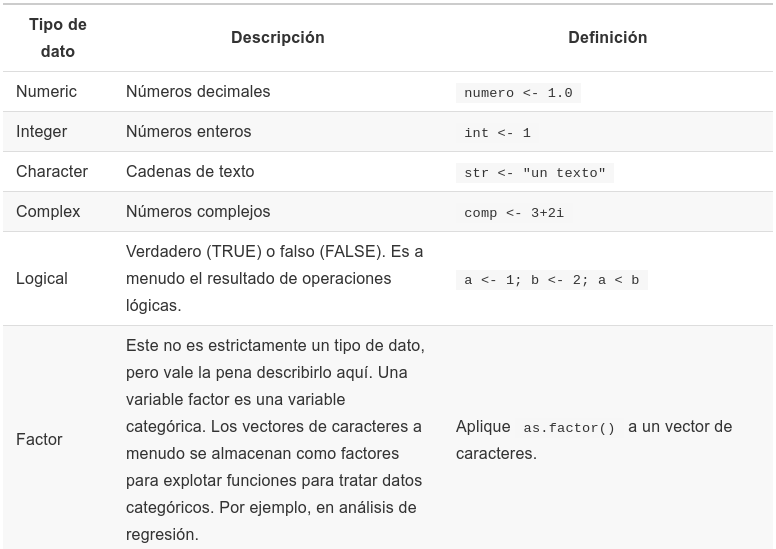
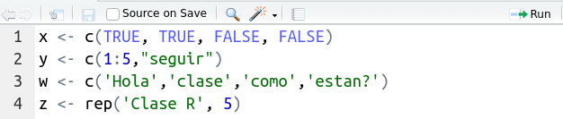

---
title       : Programación en R.
subtitle    : Módulo 01 - Tipos de datos y estructuras de datos básicos.
framework   : io2012        # {io2012, html5slides, shower, dzslides, ...}
highlighter : highlight.js  # {highlight.js, prettify, highlight}
hitheme     : github      # tomorrow
widgets     : [mathjax, quiz, bootstrap, interactive] # {mathjax, quiz, bootstrap}
ext_widgets : {rCharts: [libraries/nvd3, libraries/leaflet, libraries/dygraphs]}
mode        : selfcontained # {standalone, draft}
knit        : slidify::knit2slides
logo        : 
biglogo     : Rlogo.png
assets      : {assets: ../../assets}
--- .class #id

<style type="text/css">
body {background:grey transparent;
}
</style>


<!-- Slide 01 -->

## Agenda del Curso
> * **Módulo 1: Introducción a la programación en R.**
  <ol>
    <ul style="list-style-type:square">
    <li> Ambiente de programación. </li>
    <li> Tipos de datos y estructuras de datos básicos. </li>
    <li> Control de flujo y funciones. </li>
    </ul>
  </ol> 

> * **Módulo 2: Manejo de datos estructurados.**
  <ol>
    <ul style="list-style-type:square">
    <li> Operaciones sobre dataframes. </li>
    <li> Joins y funciones estadísticas. </li>
    </ul>
  </ol> 

> * **Módulo 3: Importar y exportar archivos de datos.**
  <ol>
    <ul style="list-style-type:square">
    <li> Importar y exportar archivos de datos. </li>
    <li> Conexión a bases de datos SQL. </li>
    </ul>
  </ol> 

> * **Módulo 4: Visualización de datos.**
 <ol>
    <ul style="list-style-type:square">
    <li> Librería ggplot2 y elementos estéticos de gráficos. </li>
    </ul>
  </ol> 


<!-- Slide 02 -->

--- .segue bg:grey

# Módulo 1: Tipos de datos y estructuras de datos básicos

--- &twocol

<!-- Slide 03 -->
## Tipos de Datos.

`R` es capaz de manejar una variedad de tipos de datos que se almacenan en diferentes estructuras.

</img>

--- &twocol

<!-- Slide 04 -->
## Operaciones Básicas
*** =left
> * Suma de dos números.
```{r, eval=FALSE}
1 + 2
```
> * Resta de dos números.
```{r, eval=FALSE}
5 - 8
```
> * Multiplicación de dos números.
```{r, eval=FALSE}
2 * 5
```
> * División de dos números.
```{r, eval=FALSE}
4 / 2
```

<span class="footnote"> Código: [M1_C2_M1_C2_script01.R]() </span>

*** =right
> * Asignar valor a una variable $x$ e imprime el valor.
```{r, eval=FALSE}
x <- 25
print(x)
```
> * Multiplicamos un número por $x$ y lo guardamos en $y$.
```{r, eval=FALSE}
y <- 2*x
print(y)
```
> * ¿Qué tipo de dato es la variable $x$ ?
```{r, eval=FALSE}
class(x)
```

<!-- Slide 05 -->

--- .segue bg:grey

# Vectores, Matrices, listas y Dataframes

--- &twocol

<!-- Slide 06 -->

## Vectores, Matrices, listas y Dataframes

</img>

> * `vector` es una estructura unidimensional.

> * `matriz` es una estructura bidimensional.

> * `lista` es una colección de elementos que pueden ser de diferente tipo.

> * `Dataframes` es una estructura de datos bidimensional similar a una matriz,
con la diferencia que puede tener tipos de datos mixtos en cada una de sus columnas (`numeric()`, `logic()`,
`character()`, etc).

*** =fullwidth

--- &twocol

<!-- Slide 07 -->

## Vectores

En `R`, existen diversas formas de construir un vector, entre ellas:

*** =left

> * `c()` ó `:`
> * `vector()`
> * `seq()`
> * `rep()`
> * **Observación:** Las funciones anteriores,
aplica para cualquier tipo de dato.

</img>

> * Los ejemplos de cada función, se encuentran en:

<span class="footnote"> Código: [M1_C2_script02.R]() </span>

*** =right
```{r, eval=FALSE}
# Combinación
x <- c(1,2,3,4,5)
```

```{r, eval=FALSE}
# Combinación mediante ":"  
y <- 1:5
```
```{r, eval=FALSE}
# Vector (numeric, integer, logical )
v <- vector("integer", 2)
```

```{r, eval=FALSE}
# Secuencias
z <- seq(5,10)
```

```{r, eval=FALSE}
# Secuencias de repeticiones
w <- rep(2, 10)
```

*** =fullwidth

--- &twocol

<!-- Slide 08 -->

## Matrices 

*** =left 

> * Una matriz es un arreglo bidimensional.
> * Una forma de crear una matriz es generando un vector y 
aplicar la función `matrix()`. 

```{r, eval=FALSE}
matrix(data = NA, nrow = 1, ncol = 1, 
          byrow = FALSE, dimnames = NULL)
```

> * Tanto en `R` como en `S` (lenguaje en base al cual se construyó R), la matriz se llena por 
columna.
> * Para llenar una matriz por filas, se usa el parametro `byrow=T`.
> * Los ejemplos de cada función, se encuentran en:

<span class="footnote"> Código: [M1_C2_script03.R]() </span>

*** =right

```{r, eval=FALSE}
# Matriz x de 2 filas y 5 columnas
x <- 1:10
matrix(x,nrow=2,ncol=5)
```

```{r, eval=FALSE}
# Matriz desde las filas
matrix(x,2,5, byrow=T)
```

```{r, eval=FALSE}
# Asigno a A la matriz creada
A <- matrix(x,2,5,byrow=T)
```

```{r, eval=FALSE}
# ¿Qué clase es la matriz A?
class(A) 
```

```{r, eval=FALSE}
# ¿Dimensión de A?
dim(A) #m filas x n columnas
```

*** =fullwidth

--- &twocol

<!-- Slide 09 -->

## Matrices 

*** =left 

**Atributos**

> * `dim(x):` Dimensión de la matriz.
> * `nrow(x):` Número de filas de matriz.   
> * `ncol(x):` Número de columnas de matriz.
> * `length(x):` Largo de la matriz (nrows $\times$ ncols).
> * `mode(x):` Que tipo de valores contiene la matriz (integer, numeric, character).
> * `cbind(x):` Concatena matrices horizontalmente (agrega columnas).
> * `rbind(x):` Concatena matrices verticalmente (agrega filas).
> * Los ejemplos de cada función, se encuentran en:
  
<span class="footnote"> Código: [M1_C2_script03.R]() </span>

*** =right

**Operaciones Algebraicas**

> * `+,-,*,\,log(),exp(),sqrt(),...`  

**Operaciones Matriciales**

> * `%*%  :` Multiplicación matricial. 
> * `t(x) :` Matriz traspuesta.
> * `solve(x):` Matriz inversa. 
> * `det(x) :` Determinante de una matriz.

```{r, eval=FALSE}
x <- matrix(1:10,2,5, byrow=T)
y <- matrix(c(1,0,0,2),2, byrow=T)
t(x)%*%y
solve(y)
det(y)
```

*** =fullwidth

--- &twocol


<!-- Slide 10 -->

## Listas

*** =left 
> * Una lista, es una colección ordenada de cualquier objeto de `R`.
> * Puede almacenar distintas estructuras de datos.
> * La función que permite crear una lista es `list()`.
> * ¿Qué se pueden hacer con las listas?:
    * Crear, añadir, quitar, unir, comparar listas,
    convertir (a vector o dataframe), anidar listas,
    etc.
> * Los ejemplos de cada función, se encuentran en:
  
<span class="footnote"> Código: [M1_C2_script04.R]() </span>


*** =right
```{r, eval=FALSE}
# Tipos de Datos
x <- c(45, 12, 56, 14, 16)
y <- c("auto", "bicicleta")
z <- matrix(1:12, ncol = 4)
```

```{r, eval=FALSE}
# Crea lista
mi_lista <- list(x, y, z)
mi_lista
```

```{r, eval=FALSE}
# Accediendo a la lista
mi_lista[1]
mi_lista[2]
mi_lista[3]
```

```{r, eval=FALSE}
# Número de elementos de la lista
length(mi_lista)
```

*** =fullwidth

--- &twocol

<!-- Slide 10 -->

## Dataframes

*** =left 
> * Un dataframe, tiene un aspecto semejante a una 
matriz, con la diferencia que puede almacenar distintos
tipos de datos.
> * La función que permite crear dataframes es `data.frame()`.
> * Los dataframes también heredan algunos atributos de las matrices
como  `dim()`, `nrow()`, `ncol()`, `length()`.
> * Aparecen otros atributos como  `dimnames()`, `names()` o `colnames()`.
> * Los ejemplos de cada función, se encuentran en:
  
<span class="footnote"> Código: [M1_C2_script05.R]() </span>

*** =right

```{r, eval=FALSE}
# Creando un dataframe
x1 <- c(100, 99,100,20)
x2 <- c(20,19,19,10)
x3 <- c("A","B","C","D")
data <- data.frame(x1,x2,x3)
print(data)
```

```{r, eval=FALSE}
# Atributos de dataframe
dim(data)
nrow(data)
ncol(data)
length(data)
dimnames(data)
names(data) 
colnames(data)
```

*** =fullwidth


