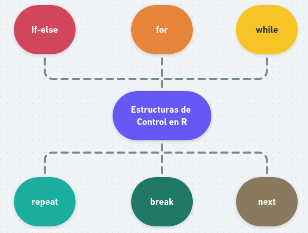
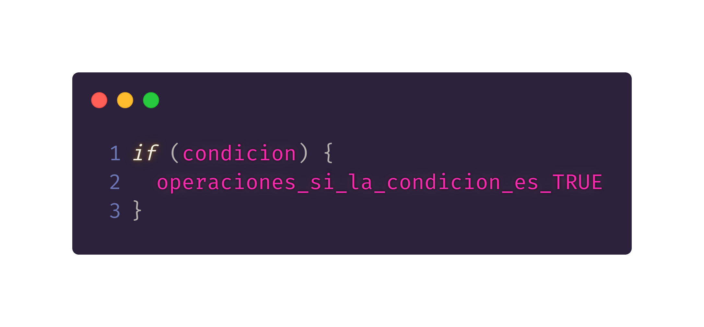
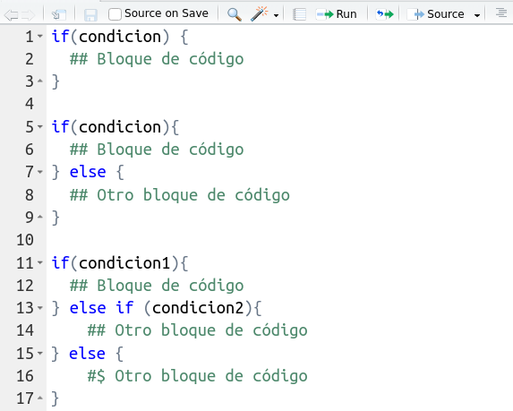
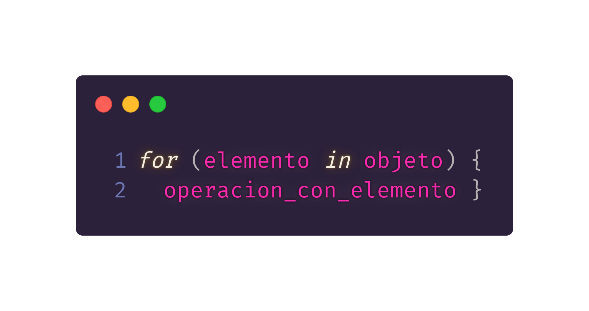
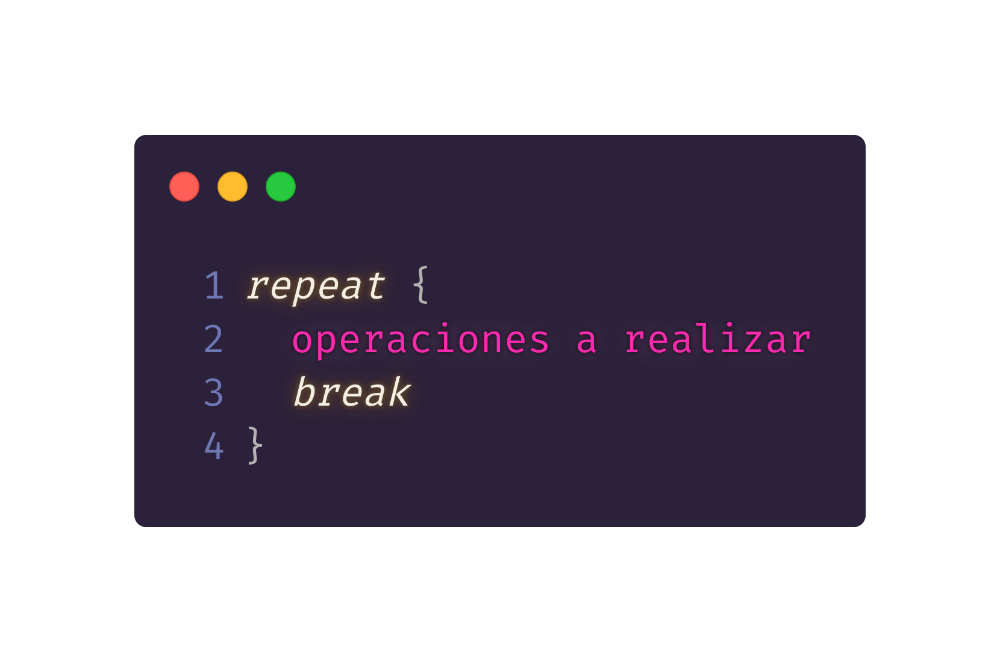
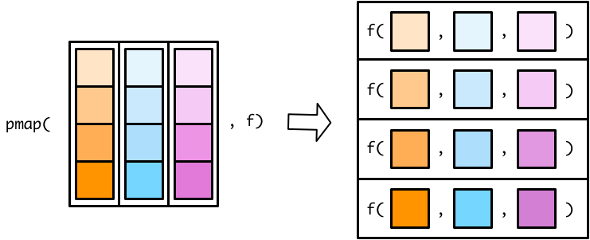
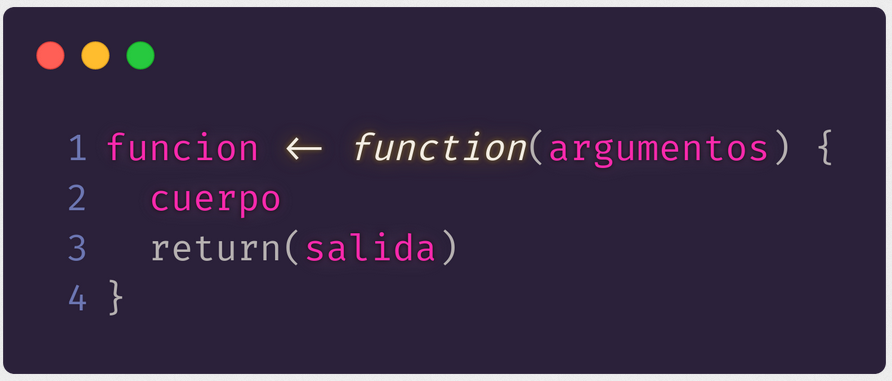

---
title       : Programación en R.
subtitle    : Módulo 01 - Control de flujo y funciones
framework   : io2012        # {io2012, html5slides, shower, dzslides, ...}
highlighter : highlight.js  # {highlight.js, prettify, highlight}
hitheme     : github      # tomorrow
widgets     : [mathjax, quiz, bootstrap, interactive] # {mathjax, quiz, bootstrap}
ext_widgets : {rCharts: [libraries/nvd3, libraries/leaflet, libraries/dygraphs]}
mode        : selfcontained # {standalone, draft}
knit        : slidify::knit2slides
logo        : 
biglogo     : Rlogo.png
assets      : {assets: ../../assets}
--- .class #id

<style type="text/css">
body {background:grey transparent;
}
</style>


<!-- Slide 01 -->

## Agenda del Curso
> * **Módulo 1: Introducción a la programación en R.**
  <ol>
    <ul style="list-style-type:square">
    <li> Ambiente de programación. </li>
    <li> Tipos de datos y estructuras de datos básicos. </li>
    <li> Control de flujo y funciones. </li>
    </ul>
  </ol> 

> * **Módulo 2: Manejo de datos estructurados.**
  <ol>
    <ul style="list-style-type:square">
    <li> Operaciones sobre dataframes. </li>
    <li> Joins y funciones estadísticas. </li>
    </ul>
  </ol> 

> * **Módulo 3: Importar y exportar archivos de datos.**
  <ol>
    <ul style="list-style-type:square">
    <li> Importar y exportar archivos de datos. </li>
    <li> Conexión a bases de datos SQL. </li>
    </ul>
  </ol> 

> * **Módulo 4: Visualización de datos.**
 <ol>
    <ul style="list-style-type:square">
    <li> Librería ggplot2 y elementos estéticos de gráficos. </li>
    </ul>
  </ol> 


<!-- Slide 02 -->

--- .segue bg:grey

# Módulo 1: Control de flujos y funciones.

--- &twocol

<!-- Slide 02 -->

## Estucturas de Control.

*** =left

* Las estructuras de control permiten controlar
el flujo de ejecución de una secuencia de comandos.

* Las estructuras de control más utilizadas son:
  * `if`, `else` 
  * `for` 
  * `while` 
  * `repeat`
  * `break`
  * `next`

*** =right

</img>


* De esta forma, se puede adherir lógica en la escritura 
de códigos en `R` y lograr reutilizar fragmentos de códigos
una y otra vez.

*** =fullwidth

--- &twocol

<!-- Slide 02 -->

## Sentencia if-else

*** =left
* La combinación `if-else` es la más utilizada en `R`.  

* `if` es usado cuando se desea que una operación se 
ejecute unicamente cuando una condición se cumple.

* `else` es usado para indicarle a `R` qué hacer en caso
de la condicion `if` no se cumpla. 

</img>

*** =right

* Existen al menos tres variantes de la sintáxis en `R`

</img>

<span class="footnote"> Código: [M1_C3_script01.R]() </span>

*** =fullwidth


--- &twocol

<!-- Slide 02 -->

## Sentencia for

*** =left

* En la programación imperativa es habitual construir bucles
dentro de los cuales se va modificando el valor de una expresión.

* La estructura `for` nos permite ejecutar un bucle o loop, realizando
una operación para cada elemento de un conjunto de datos.

</img>

*** =right
```{r, eval=FALSE}
# Ejemplo 1
for(i in 1:5){ print(i) }

# Ejemplo 2
dado <- 1:6
for(cara in dado){ dado ^ 2 }

# Ejemplo 3
x <- matrix(1:6, 2, 3)
for(i in seq_len(nrow(x))) {
  for(j in seq_len(ncol(x))) {
    print(x[i, j])
  }
}
```

<span class="footnote"> Código: [M1_C3_script02.R]() </span>

*** =fullwidth

--- &twocol

<!-- Slide 02 -->

## Sentencia While

*** =left

* Este es un tipo de bucle que ocurre mientras una 
condición es verdadera `TRUE`. 

* La operación se realiza hasta que se haga cumplir un
criterio previamente establecido.

</img>

* `Mientras esta condición sea verdadera, haz estas
operaciones`.

*** =right

```{r, eval=FALSE}
# Ejemplo 1 
i <- 0 
while(i < 10){
  print(i)
  i <- i + 1 }
```

```{r, eval=FALSE}
# Ejemplo 2
numero = 1 
suma   = 0
while(numero <= 10){
  suma   = suma + numero
  numero = numero + 1  }
  
print(suma)
```

<span class="footnote"> Código: [M1_C3_script03.R]() </span>

*** =fullwidth

--- &twocol

<!-- Slide 02 -->

## Sentencia Repeat-Break

*** =left

* El bucle `repeat()` permite repetir una operación sin condiciones 
para verificar. Para salir, usar la palabra clave `break`.

* En general, no es utilizada para realizar análisis, sino cuando se
realiza programación.

</img>

*** =right

```{r, eval=FALSE}
# Ejemplo 1
contador <- 0
repeat {
  print(contador)
  contador <- contador + 1 
  if(contador == 10) break
}

# Ejemplo 2
x <- seq(1,5)
for(i in x){
  if(i == 3){ break }
  print(i)
}
```

<span class="footnote"> Código: [M1_C3_script04.R]() </span>

*** =fullwidth

--- &twocol

<!-- Slide 02 -->

## Sentencia Next

*** =left

* `break` y `next` son palabras reservadas en `R`.

* `break` interrumpe un bucle, `next` nos deja avanzar a la siguiente iteración del bucle, “saltándose” la actual. 

* Ambas funcionan para `for()`, `while()`, `if()` y `repeat()`.

*** =right

```{r, eval=FALSE}
# Ejemplo 1 
numero <- 20 
while(numero > 5){
  if(numero == 15){ break }
  }
print(numero)

# Ejemplo 2 
for(i in 1:4) {
  if(i == 3) {
    next
  }
  print(i)
}
```

<span class="footnote"> Código: [M1_C3_script05.R]() </span>

*** =fullwidth

--- &twocol

<!-- Slide 02 -->

## Sentencia Map()

*** =left

* La función básica de **purrr** es:
  
```{r, eval=FALSE}
map(list, funcion)
```
  
* El resultado, es simple ya que coge cada elemento de la lista, 
pero a diferencia de las funciones **apply**, existen apellidos de **map_*()** que permiten obtener directamente el resultado en otro formato. 

</img>

*** =right

* La función **map()** nos permite usar una lista como secuenciador 
del bucle, pero si necesitamos más de una lista, o lo que es lo mismo, hacer un bucle anidado, debemos usar otra función de **purrr** 
```{r, eval=FALSE}
map2(lista1, lista2, función(.x, .y))
```

```{r, eval=TRUE}
x <- c(1, 2, 4)
y <- c(6, 5, 3)
purrr::map2_dbl(x, y, min)
```


<span class="footnote"> Código: [M1_C3_script06.R]() </span>

*** =fullwidth

--- &twocol

<!-- Slide 02 -->

## Sentencia Map()

*** =left

* Si como entrada necesitamos más de dos listas usaremos la función genérica 

  ```{r, eval=FALSE}
  pmap(input_list, funcion)
  ```

  ```{r, eval=TRUE}
  x <- c(1, 2, 4)
  y <- c(6, 5, 3)
  z <- c(2, 4, 6)
  pmap_dbl(list(x, y, z), min)
  ```

<span class="footnote"> Código: [M1_C3_script06.R]() </span>

*** =right

* función `pmap`

</img>

* `pmap` es una versión generalizada de `map2`

</img>

*** =fullwidth

--- &twocol

<!-- Slide 02 -->

## Funciones

*** =left

* Una función, es un conjunto de instrucciones que convierten
las entradas (inputs) en resultados (outputs) deseados.

* Las partes de una funcion se componen en:
    * `Entradas o argumentos`.
    * `Cuerpo`.
    * `Salida`.

</img>

*** =right

```{r, eval=FALSE}
# Ejemplo 1 
texto <- function(){ 
  return("Hola curso") }

# Ejemplo 2 
cuadrado <- function(x){
  return(x^2)
}

# Ejemplo 3 
xln <- function(x){
  if (x == 0) { 
  return(0) 
  } else 
    { return(-x * log(x)) } 
}
```

<span class="footnote"> Código: [M1_C3_script07.R]() </span>

*** =fullwidth
