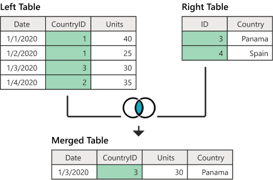
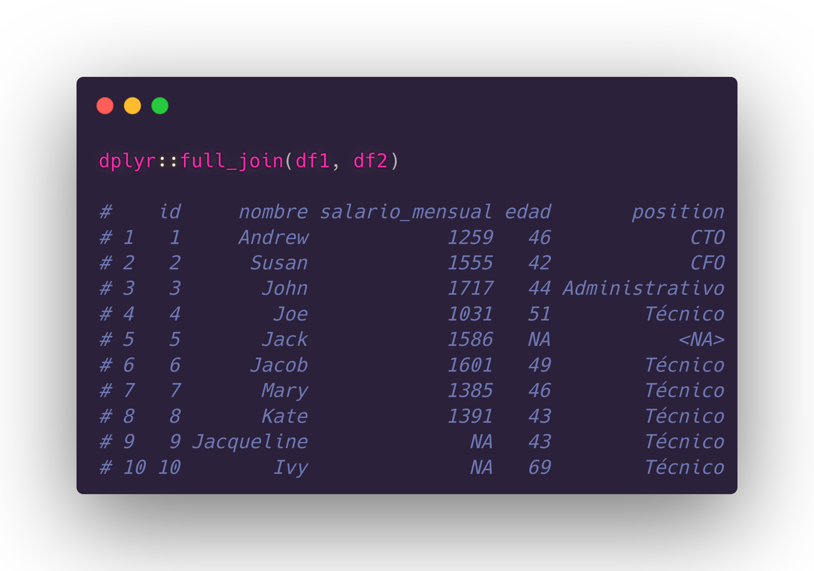

---
title       : Programación en R.
subtitle    : Módulo 02 - Manejo de datos estructurados.
framework   : io2012        # {io2012, html5slides, shower, dzslides, ...}
highlighter : highlight.js  # {highlight.js, prettify, highlight}
hitheme     : github      # tomorrow
widgets     : [mathjax, quiz, bootstrap, interactive] # {mathjax, quiz, bootstrap}
ext_widgets : {rCharts: [libraries/nvd3, libraries/leaflet, libraries/dygraphs]}
mode        : selfcontained # {standalone, draft}
knit        : slidify::knit2slides
logo        : 
biglogo     : Rlogo.png
assets      : {assets: ../../assets}
--- .class #id

<style type="text/css">
body {background:grey transparent;
}
</style>


<!-- Slide 01 -->

## Agenda del Curso
> * **Módulo 1: Introducción a la programación en R.**
  <ol>
    <ul style="list-style-type:square">
    <li> Ambiente de programación. </li>
    <li> Tipos de datos y estructuras de datos básicos. </li>
    <li> Control de flujo y funciones. </li>
    </ul>
  </ol> 

> * **Módulo 2: Manejo de datos estructurados.**
  <ol>
    <ul style="list-style-type:square">
    <li> Operaciones sobre dataframes. </li>
    <li> Joins y funciones estadísticas. </li>
    </ul>
  </ol> 

> * **Módulo 3: Importar y exportar archivos de datos.**
  <ol>
    <ul style="list-style-type:square">
    <li> Importar y exportar archivos de datos. </li>
    <li> Conexión a bases de datos SQL. </li>
    </ul>
  </ol> 

> * **Módulo 4: Visualización de datos.**
 <ol>
    <ul style="list-style-type:square">
    <li> Librería ggplot2 y elementos estéticos de gráficos. </li>
    </ul>
  </ol> 


<!-- Slide 02 -->

--- .segue bg:grey

# Módulo 2: Manejo de datos estructurados.

--- &twocol

<!-- Slide 03 -->
## Joins
*** =left

* Las sentencias de **joins** en R, al igual que en
SQL, permite combinar registros de una o más tablas
en una base de datos. 

* La función **merge** en R, permite fusionar o unir 
dos dataframes por columnas comunes o por nombres de fila.

* Permite realizar diferentes combinaciones de 
bases de datos, como unión izquierda (*left join*), 
unión interna (*inner join*), unión derecha (*right join*) o unión completa (*full join*), entre otras. 

*** =right

`Sintáxis`

```{r, echo=TRUE, eval=FALSE}
merge(x, y, by = intersect(names(x), 
names(y)), by.x = by, by.y = by,  
all = FALSE,  all.x = all, all.y = all, 
sort = TRUE, suffixes = c(".x",".y"), 
no.dups = TRUE,  incomparables = NULL, 
...)
```

>  Funciones de join en **dplyr**

```{r, eval=FALSE, echo=TRUE}
library("dplyr")
left_join()
right_join()
inner_join()
full_join()
```

*** =fullwidth

--- &twocol

<!-- Slide 03 -->
## Inner Join
*** =left

* Un *inner join*, es la unión de conjuntos de datos 
más habitual que se puede realizar. 

* Consiste en fusionar dos data frames en uno que 
contenga los elementos comunes de ambos. 

* Sintáxis en R.
  ```{r, eval=FALSE, echo=TRUE}
  merge(x,y)
  inner_join(x,y)
  ```
* Los ejemplos descritos, se encuentran en:

  <span class="footnote"> Código: [M2_C2_script01.R]() </span>

*** =right

</img> 

</img> 

*** =fullwidth


--- &twocol

<!-- Slide 03 -->
## Inner Join

```{r, eval=TRUE, echo=FALSE, message=FALSE}
library("dplyr")
set.seed(1234)
trabajador_id <- 1:10
trabajador_nombre <- c("Andrew", "Susan", "John", "Joe", "Jack",
                   "Jacob", "Mary", "Kate", "Jacqueline", "Ivy")

trabajador_salario <- round(rnorm(10, mean = 1500, sd = 200))
trabajador_edad    <- round(rnorm(10, mean = 50, sd = 8))
trabajador_puesto  <- c("CTO", "CFO", "Administrativo", rep("Técnico", 7))

df1 <- data.frame(id = trabajador_id[1:8], nombre = trabajador_nombre[1:8],
                  salario_mensual = trabajador_salario[1:8])

df2 <- data.frame(id = trabajador_id[-5], nombre = trabajador_nombre[-5],
                   edad = trabajador_edad[-5], position = trabajador_puesto[-5])                  
```

*** =left

  ```{r, eval=FALSE, echo=TRUE, message=FALSE}
  merge(x = df1, y = df2)
  ```
</img> 

  ```{r, eval=FALSE, echo=TRUE, message=FALSE}
  merge(x = df1, y = df2, 
              by = c("id", "nombre"))
  ```

*** =right

```{r, eval=FALSE, echo=TRUE, message=FALSE}
dplyr::inner_join(df1, df2)
```
</img> 

```{r, eval=FALSE, echo=TRUE, message=FALSE}
dplyr::inner_join(df1, df2, 
                  by = c("id", "nombre"))
```

*** =fullwidth


--- &twocol

<!-- Slide 03 -->
## Full (outer) Join

*** =left

* El outer join, o unión completa, combina todas las columnas de 
  ambos conjuntos de datos en uno para todos los elementos.

* Para crear el *full outer* join de dos data frames con *merge*
hay que establecer el argumento `all` como `TRUE`

* Los ejemplos descritos, se encuentran en:

  <span class="footnote"> Código: [M2_C2_script02.R]() </span>


*** =right

</img> 

</img> 

*** =fullwidth

--- &twocol

<!-- Slide 03 -->
## Full (outer) Join

*** =left

  ```{r, eval=FALSE, echo=TRUE, message=FALSE}
  merge(x = df1, y = df2, all = TRUE)
  ```
</img> 


*** =right

```{r, eval=FALSE, echo=TRUE, message=FALSE}
dplyr::full_join(df1, df2)
```
</img> 

*** =fullwidth

--- &twocol


<!-- Slide 03 -->
## Left (outer) Join

*** =left

* El `left join` en R consiste en unir todas las filas del 
primer data frame con los valores correspodientes del segundo.

* Para crear el *left outer* join de dos data frames con *merge*
hay que establecer el argumento `all.x` como `TRUE`

* Los ejemplos descritos, se encuentran en:

  <span class="footnote"> Código: [M2_C2_script03.R]() </span>

*** =right

</img> 

</img> 

*** =fullwidth


--- &twocol

<!-- Slide 03 -->
## Left (outer) Join

*** =left

  ```{r, eval=FALSE, echo=TRUE, message=FALSE}
  merge(x = df1, y = df2, all.x = TRUE)
  ```
</img> 


*** =right

```{r, eval=FALSE, echo=TRUE, message=FALSE}
dplyr::left_join(df1, df2)
```
</img> 

*** =fullwidth


--- &twocol

<!-- Slide 03 -->
## Right (outer) Join
*** =left

* El right join en R es lo opuesto al left outer join. En este caso, la combinación consiste en unir todas las filas del segundo data frame con las correspondientes en el primero.

* Para crear el *right outer* join de dos data frames con *merge*
hay que establecer el argumento `all.y` como `TRUE`

* Los ejemplos descritos, se encuentran en:

  <span class="footnote"> Código: [M2_C2_script04.R]() </span>

*** =right

</img> 

</img> 


*** =fullwidth

--- &twocol

<!-- Slide 03 -->
## Right (outer) Join
*** =left

  ```{r, eval=FALSE, echo=TRUE, message=FALSE}
  merge(x = df1, y = df2, all.y = TRUE)
  ```
</img> 

*** =right

```{r, eval=FALSE, echo=TRUE, message=FALSE}
dplyr::right_join(df1, df2)
```
</img> 

*** =fullwidth

--- &twocol

<!-- Slide 03 -->
## Funciones Estadísticas
*** =left

* `summarise()` crea un nuevo marco de datos.

* la salida tendrá una sola fila que resuma todas las 
observaciones en la entrada. 

* Contendrá una columna para cada variable de agrupación 
y una columna para cada una de las estadísticas de resumen 
que haya especificado.

* Los ejemplos descritos, se encuentran en:

  <span class="footnote"> Código: [M2_C2_script05.R]() </span>

*** =right

```{r, eval=FALSE, echo=TRUE, message=FALSE}
iris %>% 
  group_by(Species) %>%
  summarise(n = n())
```

```{r, eval=FALSE, echo=TRUE, message=FALSE}
iris %>% 
  group_by(Species) %>%
  summarise(
    n = n() ,
    Sepal.Mean = mean(Sepal.Width), 
    Sepal.Sd = sd(Sepal.Width)
  )
```

> `Funciones Útiles.` de tendencia central, conteo, posición,
rango, dispersión, etc.


*** =fullwidth