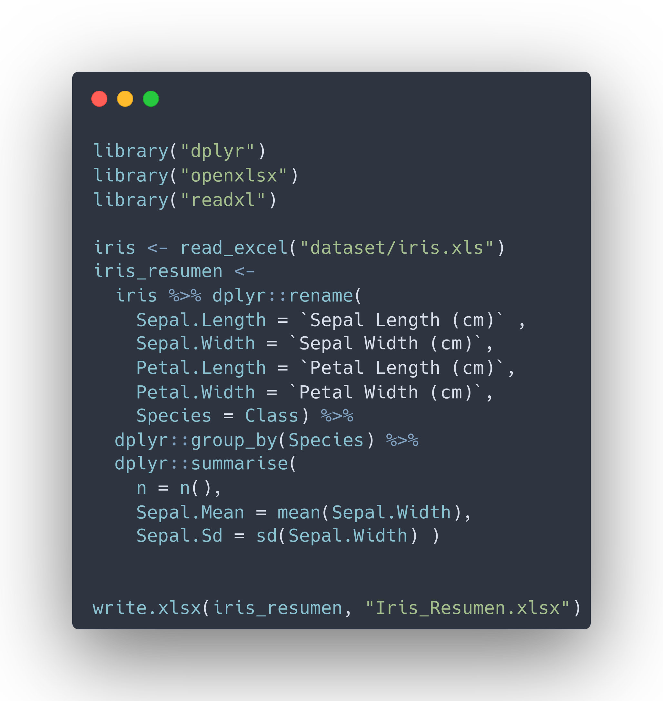

---
title       : Programación en R.
subtitle    : Módulo 03 - Importar y exportar archivos de datos.
framework   : io2012        # {io2012, html5slides, shower, dzslides, ...}
highlighter : highlight.js  # {highlight.js, prettify, highlight}
hitheme     : github      # tomorrow
widgets     : [mathjax, quiz, bootstrap, interactive] # {mathjax, quiz, bootstrap}
ext_widgets : {rCharts: [libraries/nvd3, libraries/leaflet, libraries/dygraphs]}
mode        : selfcontained # {standalone, draft}
knit        : slidify::knit2slides
logo        : 
biglogo     : Rlogo.png
assets      : {assets: ../../assets}
--- .class #id

<style type="text/css">
body {background:grey transparent;
}
</style>


<!-- Slide 01 -->

## Agenda del Curso
> * **Módulo 1: Introducción a la programación en R.**
  <ol>
    <ul style="list-style-type:square">
    <li> Ambiente de programación. </li>
    <li> Tipos de datos y estructuras de datos básicos. </li>
    <li> Control de flujo y funciones. </li>
    </ul>
  </ol> 

> * **Módulo 2: Manejo de datos estructurados.**
  <ol>
    <ul style="list-style-type:square">
    <li> Operaciones sobre dataframes. </li>
    <li> Joins y funciones estadísticas. </li>
    </ul>
  </ol> 

> * **Módulo 3: Importar y exportar archivos de datos.**
  <ol>
    <ul style="list-style-type:square">
    <li> Importar y exportar archivos de datos. </li>
    <li> Conexión a bases de datos SQL. </li>
    </ul>
  </ol> 

> * **Módulo 4: Visualización de datos.**
 <ol>
    <ul style="list-style-type:square">
    <li> Librería ggplot2 y elementos estéticos de gráficos. </li>
    </ul>
  </ol> 


<!-- Slide 02 -->

--- .segue bg:grey

# Módulo 3: Importar y exportar archivos de datos.

--- &twocol

<!-- Slide 03 -->
## Importar Archivos
*** =left

* En `RStudio`, existen al menos tres formas de importar datos.
 * Utilizando los menús de `Rstudio` .
 * Utilizando la consola de `Rstudio`.
 * Utilizando código en un script. 

* Utilizando el menú, son las siguientes.

> `Environment > Import Dataset`
</img>

*** =right

> `File > Import Dataset`
</img>


*** =fullwidth


--- &twocol

<!-- Slide 03 -->
## Tipos de Archivos

*** =left

* Datos en formato texto.
  * csv, txt, dat, et.
  
* Formato de otros programas.
  * Excel (.xls y .xlsx)
  * SPSS (.sav y .por)
  * STATA (.dta)
  * SAS (.sas)

* Formatos propios de R
  * R objects (.RData o .rda)
  * Serialized R Objects (.rds)

* Otros formatos
  * JSON, XML, feather


*** =right

</img>

*** =fullwidth


--- &twocol

<!-- Slide 03 -->
## Importar Texto Plano
*** =left

* Cuando se habla de datos de texto plano, se habla
de datos tabulares (columnas son variables y filas son
observaciones).

* El paquerte `utils` trae por defecto, las siguientes funciones:

  * `read.csv()`
  * `read.table()`.

* Los ejemplos descritos, se encuentran en:

  <span class="footnote"> Código: [M3_C1_script01.R]() </span>

*** =right

```{r, echo=TRUE, eval=FALSE, message=FALSE}
iris <- read.csv("dataset/iris.csv", 
                 sep = ";")
```

* Si no recuerdas donde está el archivo, puedes utilizar
como argumento `file.choose()`

```{r, echo=TRUE, eval=FALSE, message=FALSE}
iris <- read.csv(file.choose(),
                 sep = ";")
```

* La lectura con `read.table` es de la siguiente manera

```{r, echo=TRUE, eval=FALSE, message=FALSE}
iris <- read.table("dataset/iris.csv", 
                   sep = ";")
```

*** =fullwidth

--- &twocol

<!-- Slide 03 -->
## Importar Texto Plano
*** =left

* Sin embargo, a través del tiempo fueron apareciendo paquetes optimizados
como por ejemplo `readr`.

* Existen algunas diferencias entre `read.csv()` y `read_csv()`. Las funciones del paquete `readr` suelen: 
  
  * Ser más rápidas
  * Encajar en el paradigma de investigación reproducible.
  * Producir tibbles.

* Los ejemplos descritos, se encuentran en:

  <span class="footnote"> Código: [M3_C1_script02.R]() </span>

*** =right

</img>

* El paquete `readr` lee datos tabulares con las siguientes funciones  
  * read_delim(), read_csv(), read_tsv().
  * read_fwf() y read_table().
  
* Archivo `iris.csv` esta separado por ;

```{r, echo=TRUE, eval=FALSE, message=FALSE}
iris <- read_delim("dataset/iris.csv", 
                   delim = ";")
```

<footnote>Mayor Información [aquí](https://r4ds.had.co.nz/data-import.html)</footnote>

*** =fullwidth

--- &twocol

<!-- Slide 03 -->
## Importar Texto Plano
*** =left

* Una opción alternativa, es emplear la función 
`fread` (del paquete `data.table`).

* Tamaño del archivo de datos es grande, 
en particular, mayor a 1Gb.

  ```{r, echo=TRUE, eval=FALSE, message=FALSE}
  datos <- fread(input = "PATH",
               header = TRUE, 
               col.names = columnas,
               sep = ",",
               dec = ".",
               showProgress = TRUE)
  ```

* Los ejemplos descritos, se encuentran en:

  <span class="footnote"> Código: [M3_C1_script03.R]() </span>

*** =right

```{r, echo=TRUE, eval=TRUE, message=FALSE}
library("data.table")
library("dplyr")
iris <- fread("dataset/iris.csv", 
              nrows = 7) %>% 
  select(1:2)
iris
```

--- &twocol


<!-- Slide 03 -->
## Exportar Texto Plano

*** =left

* La exportación de datos, es bastante sencilla
pensando tanto en los paquetes `readr` como las funciones
base de `utils`.

</img>

* Los ejemplos descritos, se encuentran en:

  <span class="footnote"> Código: [M3_C1_script04.R]() </span>


*** =right

* `write.csv` solo puede guardar archivos de texto plano
con separadores de comma.

* `write.table` permite guardar estos mismos archivos con
diferentes tipos de separadores (`,`, `;`, `|`, etc).

* `write_csv` solo guarda archivos en
separadores de comma.

* `write_delim` permite guardar estos mismos archivos con
diferentes tipos de separadores (`,`, `;`, `|`, etc).

* `fwrite` guarda archivos con diferentes tipos de separadores 
(`,`, `;`, `|`, etc). (mucho más rápido).


*** =fullwidth

--- &twocol
<!-- Slide 03 -->
## Importar Archivos Excel

*** =left

* Algunos de los paquetes útiles para trabajar con archivos Excel y sus códigos de instalación son:

  ```{r, echo=TRUE, eval=FALSE, message=FALSE}
  install.packages("readxl", dep=TRUE)
  install.packages("xlsx", dep=TRUE)
  install.packages("openxlsx", dep=TRUE)
  ```

* Carga de librerías.
  
  ```{r, echo=TRUE, eval=FALSE, message=FALSE}
  library("readxl")
  library("xlsx")
  library("openxlsx")
  ```
* Los ejemplos descritos, se encuentran en:

  <span class="footnote"> Código: [M3_C1_script05.R]() </span>

*** =right

```{r, echo=TRUE, eval=FALSE, message=FALSE}
library("readxl")
# Ruta de archivo xlsx
ruta_archivo <- readxl_example("clippy.xlsx")
# Nombres de las hojas 
excel_sheets(ruta_archivo)
# Lectura data en ruta
data <- read_excel(ruta_archivo)
# Lecturas Hojas de un Excel 

# Forma 1
df1 <- read_excel(ruta_archivo, 
              sheet = "two-row-header")
# Forma 2
df2 <- read_excel(ruta_archivo, 
              sheet = 2)
```

*** =fullwidth


--- &twocol

<!-- Slide 03 -->

## Importar Archivos Excel

*** =left
* Saltarse Filas
  ```{eval=FALSE, echo = TRUE}
  read_excel(ruta_archivo, skip = 1)
  ```

* Especificar Rangos 
  ```{eval=FALSE, echo = TRUE}
  read_excel(ruta_archivo, range = "B1:B5")
  ```

* No leer nombres de columnas
  ```{eval=FALSE, echo = TRUE}
  read_excel(ruta_archivo, col_names = FALSE)
  ```
* Convertir a dataframe

  ```{eval=FALSE, echo=TRUE}
  read_excel(ruta_archivo) %>% data.frame()
  ```
  
*** =right

* Exportar datos

 ```{eval=FALSE, echo=TRUE}
  write.xlsx(iris_resumen, "Iris_Resumen.xlsx")
  ```

</img>

*** =fullwidth


