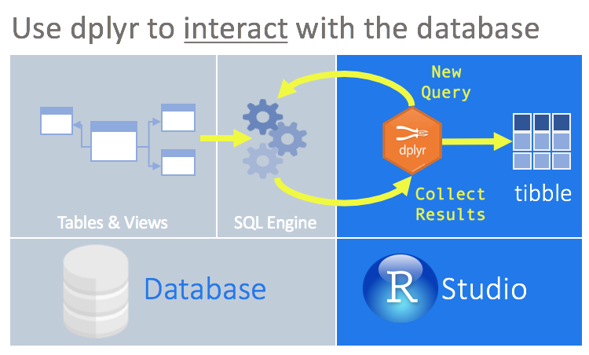
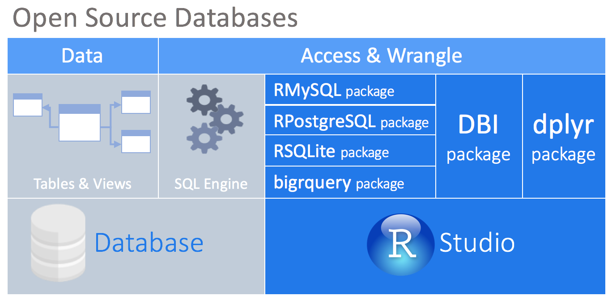
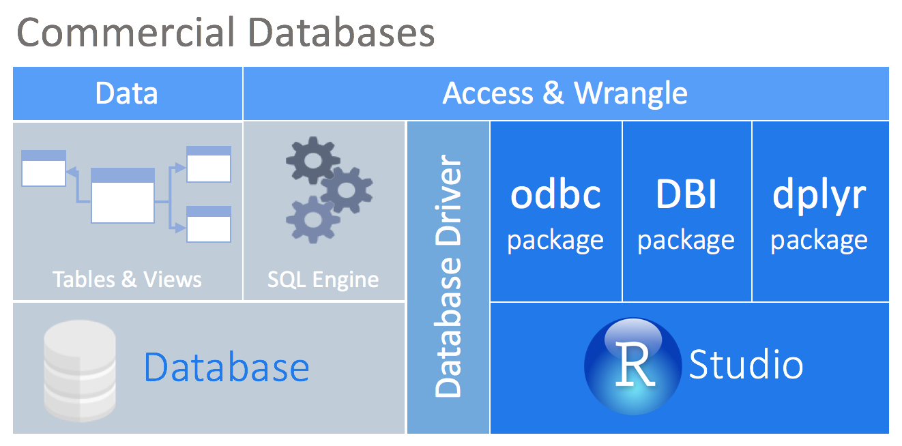
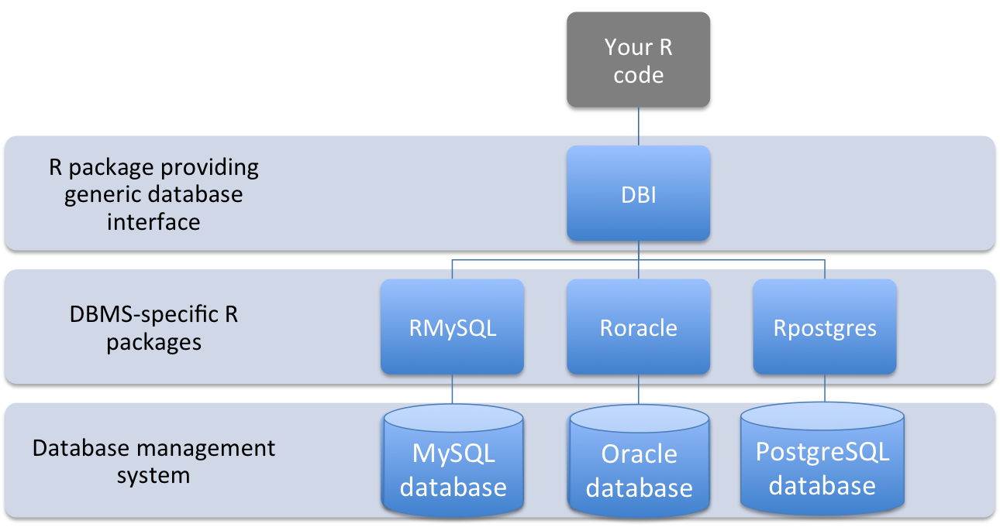
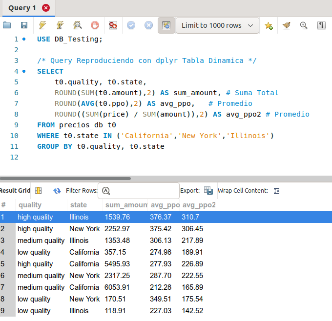
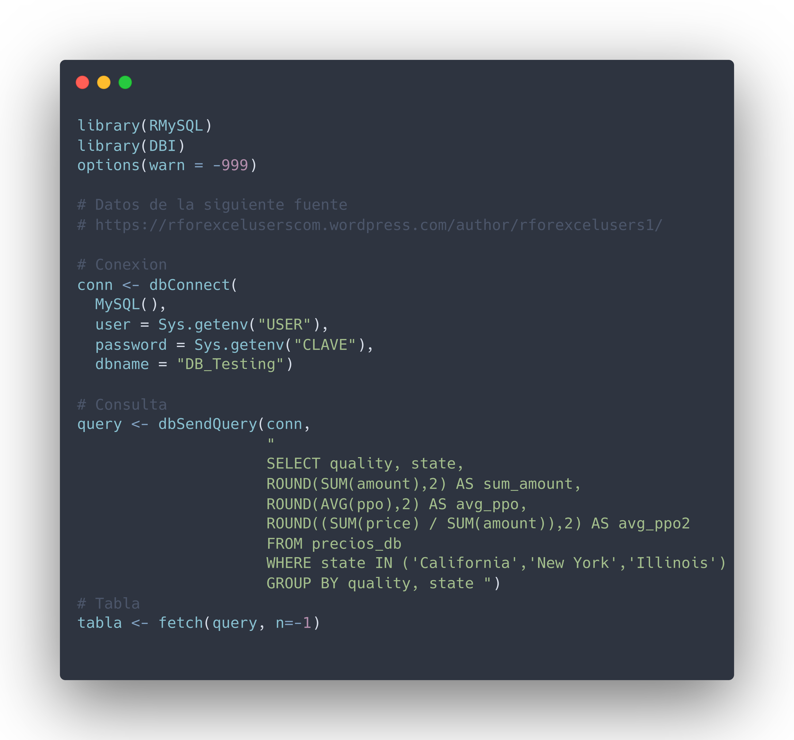

---
title       : Programación en R.
subtitle    : Módulo 03 - Importar y exportar archivos de datos.
framework   : io2012        # {io2012, html5slides, shower, dzslides, ...}
highlighter : highlight.js  # {highlight.js, prettify, highlight}
hitheme     : github      # tomorrow
widgets     : [mathjax, quiz, bootstrap, interactive] # {mathjax, quiz, bootstrap}
ext_widgets : {rCharts: [libraries/nvd3, libraries/leaflet, libraries/dygraphs]}
mode        : selfcontained # {standalone, draft}
knit        : slidify::knit2slides
logo        : 
biglogo     : Rlogo.png
assets      : {assets: ../../assets}
--- .class #id

<style type="text/css">
body {background:grey transparent;
}
</style>


<!-- Slide 01 -->

## Agenda del Curso
> * **Módulo 1: Introducción a la programación en R.**
  <ol>
    <ul style="list-style-type:square">
    <li> Ambiente de programación. </li>
    <li> Tipos de datos y estructuras de datos básicos. </li>
    <li> Control de flujo y funciones. </li>
    </ul>
  </ol> 

> * **Módulo 2: Manejo de datos estructurados.**
  <ol>
    <ul style="list-style-type:square">
    <li> Operaciones sobre dataframes. </li>
    <li> Joins y funciones estadísticas. </li>
    </ul>
  </ol> 

> * **Módulo 3: Importar y exportar archivos de datos.**
  <ol>
    <ul style="list-style-type:square">
    <li> Importar y exportar archivos de datos. </li>
    <li> Conexión a bases de datos SQL. </li>
    </ul>
  </ol> 

> * **Módulo 4: Visualización de datos.**
 <ol>
    <ul style="list-style-type:square">
    <li> Librería ggplot2 y elementos estéticos de gráficos. </li>
    </ul>
  </ol> 


<!-- Slide 02 -->

--- .segue bg:grey

# Módulo 3: Conexión a bases de datos SQL.

--- &twocol

<!-- Slide 03 -->
## Conexión a bases de datos SQL
*** =left

* `dplyr` como interfaz de base de datos.

</img>

* `dplyr` es capaz de interactuar con las bases de datos directamente 
traduciendo los dplyr *verbos* en consultas SQL.

* `Fuente:` https://db.rstudio.com/getting-started/overview/

*** =right

* Conectarse a una base de datos

</img>

</img>

*** =fullwidth

--- &twocol

<!-- Slide 03 -->
## Conexión a bases de datos SQL
*** =left

* El centro de este enfoque es el paquete `DBI` (Data Base Interface). 

* Actúa como middle-ware entre los paquetes para permitir la 
conectividad con la base de datos del usuario u otros paquetes.

* Instalación
  ```{eval=FALSE, echo=TRUE}
  install.packages("DBI", dep=TRUE)
  ```

* Carga de librería
  ```{eval=FALSE, echo=TRUE}
  library("DBI")
  ```
*** =right

</img>

* `Ejemplo` 

```{eval=FALSE, echo=TRUE}
library("DBI")
conn <- dbConnect(
  MySQL(),
  user="users",
  password="pass",
  dbname="DB_Table")
```

*** =fullwidth

--- &twocol

<!-- Slide 03 -->
## Consulta desde R
*** =left

</img>

*** =right

* `Réplica query en Rstudio`

</img>

* El ejemplo descrito, se encuentran en:

  <span class="footnote"> Código: [M3_C2_script01.R]() </span> 

*** =fullwidth
