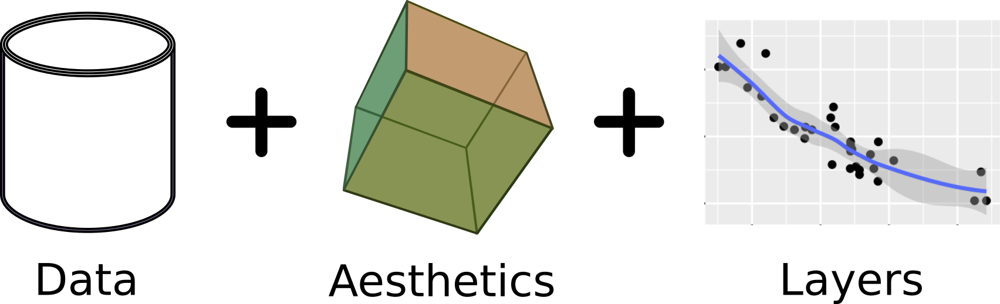
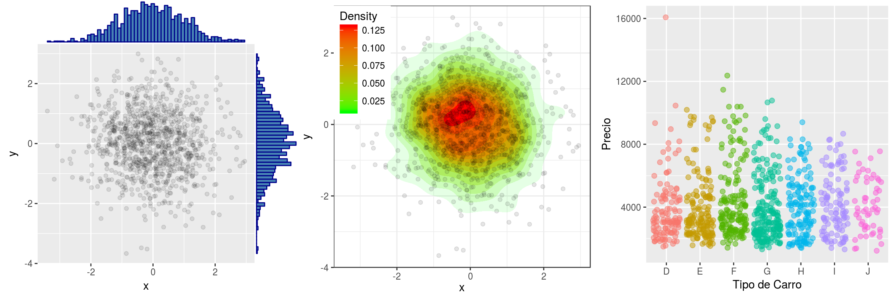

---
title       : Programación en R.
subtitle    : Módulo 04 - Visualización de datos.
framework   : io2012        # {io2012, html5slides, shower, dzslides, ...}
highlighter : highlight.js  # {highlight.js, prettify, highlight}
hitheme     : github      # tomorrow
widgets     : [mathjax, quiz, bootstrap, interactive] # {mathjax, quiz, bootstrap}
ext_widgets : {rCharts: [libraries/nvd3, libraries/leaflet, libraries/dygraphs]}
mode        : selfcontained # {standalone, draft}
knit        : slidify::knit2slides
logo        : 
biglogo     : Rlogo.png
assets      : {assets: ../../assets}
--- .class #id

<style type="text/css">
body {background:grey transparent;
}
</style>


<!-- Slide 01 -->

## Agenda del Curso
> * **Módulo 1: Introducción a la programación en R.**
  <ol>
    <ul style="list-style-type:square">
    <li> Ambiente de programación. </li>
    <li> Tipos de datos y estructuras de datos básicos. </li>
    <li> Control de flujo y funciones. </li>
    </ul>
  </ol> 

> * **Módulo 2: Manejo de datos estructurados.**
  <ol>
    <ul style="list-style-type:square">
    <li> Operaciones sobre dataframes. </li>
    <li> Joins y funciones estadísticas. </li>
    </ul>
  </ol> 

> * **Módulo 3: Importar y exportar archivos de datos.**
  <ol>
    <ul style="list-style-type:square">
    <li> Importar y exportar archivos de datos. </li>
    <li> Conexión a bases de datos SQL. </li>
    </ul>
  </ol> 

> * **Módulo 4: Visualización de datos.**
 <ol>
    <ul style="list-style-type:square">
    <li> Librería ggplot2 y elementos estéticos de gráficos. </li>
    </ul>
  </ol> 


<!-- Slide 02 -->

--- .segue bg:grey

# Módulo 4: Visualización de datos.

--- &twocol

<!-- Slide 03 -->
## ¿Qué es ggplot2 ?
*** =left

> * Es un paquete de visualización de datos para el lenguaje R.

> * `gg` viene de *Grammar of Graphics* o gramática de gráficos (Leland Wilkinson).

> * Es una representación esquemática y en capas de lo que se dibuja en dichos gráficos.

> * La instalación es bastante sencilla.
```{r, eval=FALSE, echo=TRUE}
install.packages("ggplot2", dep=TRUE)
```

*** =right

</img>

</img>

*** =fullwidth

--- &twocol

<!-- Slide 03 -->
## Capas 

*** =left

* Las visualizaciones de `ggplot` se construyen paso a paso agregando nuevos
elementos, uno encima de otro, usando el operador `+`. 

* Estos nuevos elementos, son denominadas `capas`.

  * `Data` & `aesthetics.`
  * `Geometries.`
  * `Facets.`
  * `Statistics.`
  * `Coordinates.`
  * `Theme.`  

*** =right

</img>

Para utilizar esta librería, basta con cargarla como:
```{r, echo=TRUE, eval=FALSE}
library("ggplot2")
```

*** =fullwidth

--- &twocol

<!-- Slide 03 -->
## Data & aesthetics  

*** =left

* Uno de los elementos más importantes de un gráfico son los *datos* (`data`) que
se quieren presentar. Una particularidad de `ggplot2` es que sólo se acepta un tipo
de datos, `dataframes`.

* Para crear un objeto `ggplot` protográfico, basta con seguir la siguiente instrucción.
```{r, eval=FALSE, echo = TRUE}
ggplot(data)
```

* Los ejemplos descritos, se encuentran en:

  <span class="footnote"> Código: [M4_C1_script01.R]() </span>

*** =right
`Ejemplo 1`

```{r, eval=TRUE, echo = TRUE, fig.height = 4, fig.width = 8}
data("iris")
ggplot(data = iris)
```

Esto, sólo contiene los datos, aún no hemos indicado qué queremos hacer con el conjunto de datos `iris`.

*** =fullwidth

--- &twocol

<!-- Slide 03 -->
## Data & aesthetics  

*** =left

* En `ggplot`, `aes()` hace referencia al contenido estético del gráfico 
(del ingles aesthetics). Es decir, la función le dará indicios a `ggplot2` 
sobre cómo dibujar los distintos trazos, formas, colores y tamaños. 

* Es importante notar que `aes()` crea una nueva capa en relación a las variables 
y agrega leyendas a los gráficos.

* Los ejemplos descritos, se encuentran en:

  <span class="footnote"> Código: [M4_C1_script01.R]() </span>

*** =right
`Ejemplo 2`

```{r, eval=TRUE, echo = TRUE, fig.height = 4, fig.width = 8}
data("iris")
ggplot(data = iris, aes(
  x = Sepal.Length, y = Petal.Length, 
  colour = Species))
```

Si bien reconoce los ejes, aún sigue siendo un protográfico. 

*** =fullwidth

--- &twocol

<!-- Slide 03 -->
## Geometries 

*** =left

* Las capas `geom_*()` para `ggplot2` son los verbos 
del lenguaje de los gráficos. 

* Indican qué hacer con los datos y las estéticas 
elegidas y cómo representarlos en un lienzo.

* Las geometrías mas usadas son:
  * `geom_point()`
  * `geom_line()`
  * `geom_boxplot()` 
  * `geom_histogram()` 
  * `geom_bar()`
  * `geom_density()`
  
*** =right

Algunos de los ejemplos que se pueden lograr con `ggplot`.

</img>

</img>

librerías complementarias a `ggplot2`

https://exts.ggplot2.tidyverse.org/gallery/

*** =fullwidth

--- &twocol

<!-- Slide 03 -->
## geom_point() 

*** =left

* La función `geom_point()` agrega una capa de puntos al gráfico creando
un diagrama de dispersión o scatterplot.

*  La sintáxis para generar este tipo de gráfico, es la siguiente :
```{r, echo=TRUE, eval=FALSE}
ggplot(data, aes(x=x, y=y)) + 
  geom_point()
```

* `data` es un dataframe.

* Los ejemplos descritos, se encuentran en:

  <span class="footnote"> Código: [M4_C1_script02.R]() </span>
  
*** =right
`Ejemplo 3`

```{r, eval=TRUE, echo=TRUE, fig.height = 4, fig.width = 8}
ggplot(data = iris, aes(
  x = Sepal.Length, y = Petal.Length)) + 
  geom_point()
```
Dentro de `geom_point()` podemos utilizar diferentes atributos, por ejemplo
tamaño, forma, translucidez de los puntos, entre otros.

*** =fullwidth

--- &twocol

<!-- Slide 03 -->
## geom_point() 

*** =left
`Ejemplo 4`
```{r, eval=TRUE, echo=TRUE, fig.height = 5, fig.width = 8}
ggplot(data = iris, aes(x = Sepal.Length, 
  y = Petal.Length, colour = Species)) + 
  geom_point(size = 3)
```

*** =right
`Ejemplo 5`
```{r, eval=TRUE, echo=TRUE, fig.height = 5, fig.width = 8}
ggplot(data = iris, aes(x = Sepal.Length, 
  y = Petal.Length, colour = Species)) + 
  geom_point(size = 3, aes(shape=Species))
```

*** =fullwidth

--- &twocol

<!-- Slide 03 -->
## geom_point() 

*** =left
`Ejemplo 6`
```{r, eval=TRUE, echo=TRUE, fig.height = 5, fig.width = 8}
ggplot(data = iris, aes(x=Sepal.Length, 
  y=Petal.Length, group=Species)) + 
  geom_point(aes(shape=Species, 
    color=Species), size = 3)
```

*** =right
`Ejemplo 7`
```{r, eval=TRUE, echo=TRUE, fig.height = 5, fig.width = 8}
ggplot(data = iris, aes(x = Sepal.Length, 
  y = Petal.Length, colour = Species)) + 
  geom_point(size = 3, 
             alpha = 0.5)
```

*** =fullwidth

--- &twocol

<!-- Slide 03 -->
## geom_line() 

*** =left

* La capa `geom_line()` se usa frecuentemente cuando hay una 
variable de datos continuos ordenada secuencialmente (ejemplo: series de tiempo).


* La sintáxis para generar este tipo de gráfico, es la siguiente:
  ```{r, eval=F, echo=TRUE}
  ggplot(data , aes(x=x, y=y)) + 
                  geom_line()
  ```

* Los ejemplos descritos, se encuentran en:

  <span class="footnote"> Código: [M4_C1_script03.R]() </span>

*** =right

`Ejemplo 8`

```{r, eval=TRUE, echo=FALSE}
data("economics")
```

```{r, eval=TRUE, echo=TRUE, fig.height = 4, fig.width = 8}
ggplot(data = economics, aes(x=date, 
  y=uempmed)) + geom_line()
```

Dentro de `geom_line()` podemos utilizar diferentes atributos, por ejemplo
tamaño, forma, translucidez de los puntos, entre otros.

*** =fullwidth

--- &twocol

<!-- Slide 03 -->
## geom_line() 

*** =left
`Ejemplo 9`
```{r, eval=TRUE, echo=TRUE, fig.height = 5, fig.width = 8}
ggplot(data = economics, aes(x=date, 
  y=uempmed)) + geom_line(size = 1.5, 
  color = "blue", alpha = 0.5)
```

*** =right
`Ejemplo 10`
```{r, eval=TRUE, echo=FALSE}
library("dslabs")
```

```{r, eval=TRUE, echo=TRUE, fig.height = 5, fig.width = 8}
ggplot(data = gapminder, aes(x=year, 
  y=life_expectancy, by=country,
   colour=continent)) + geom_line()
```

*** =fullwidth

--- &twocol


<!-- Slide 03 -->
## geom_boxplot() 

*** =left

* La capa `geom_boxplot()` visualiza en forma compacta la  distribución de una variable continua. Visualiza cinco estadísticas de resumen (la mediana, dos bisagras y dos bigotes) y todos los puntos periféricos individualmente.

* La sintáxis para generar este tipo de gráfico, es la siguiente:
  ```{r, eval=F, echo=TRUE}
  ggplot(data , aes(x=x, y=y)) + 
                  geom_boxplot()
  ```

* Los ejemplos descritos, se encuentran en:

  <span class="footnote"> Código: [M4_C1_script04.R]() </span>

*** =right

`Ejemplo 11`

```{r, eval=TRUE, echo=FALSE}
data("diamonds")
```

```{r, eval=TRUE, echo=TRUE, fig.height = 4, fig.width = 8}
ggplot(diamonds, aes(x=cut, y=price)) +
  geom_boxplot()
```

Dentro de `geom_boxplot()` podemos utilizar diferentes atributos, por ejemplo
tamaño, forma, translucidez de los puntos, entre otros.

*** =fullwidth

--- &twocol

<!-- Slide 03 -->
## geom_boxplot() 

*** =left
`Ejemplo 12`
```{r, eval=TRUE, echo=TRUE, fig.height = 5, fig.width = 8}
ggplot(diamonds, aes(x=cut, y=price, 
  fill=cut)) + geom_boxplot(
          outlier.colour = "red")
```

*** =right
`Ejemplo 13`

```{r, eval=TRUE, echo=TRUE, fig.height = 5, fig.width = 8}
ggplot(diamonds, aes(x=cut, y=price, fill=cut)) + 
  geom_boxplot(outlier.colour = "red", 
  outlier.size = 1, outlier.shape = 16)
```

*** =fullwidth


--- &twocol

<!-- Slide 03 -->
## geom_boxplot() 

*** =left
`Ejemplo 14`
```{r, eval=TRUE, echo=TRUE, fig.height = 5, fig.width = 8}
ggplot(diamonds, aes(x=cut, y=price, 
  fill=cut)) + geom_boxplot(notch=TRUE)
```

*** =right
`Ejemplo 15`

```{r, eval=TRUE, echo=TRUE, fig.height = 5, fig.width = 8}
ggplot(diamonds, aes(x=cut, y=price, 
  fill=cut)) + geom_violin()
```

*** =fullwidth

--- &twocol


<!-- Slide 03 -->
## geom_histogram() 

*** =left

* La capa `geom_histogram()` visualiza la  distribución de una variable continua. En 
este sentido, muestra en su defecto el histograma de una variable y las frecuencias
absolutas de cada marca de clase o `bins`.

* La sintáxis para generar este tipo de gráfico, es la siguiente:
  ```{r, eval=F, echo=TRUE}
  ggplot(data , aes(x=x, y=y)) + 
                  geom_histogram()
  ```

* Los ejemplos descritos, se encuentran en:

  <span class="footnote"> Código: [M4_C1_script05.R]() </span>

*** =right

`Ejemplo 16`

```{r, eval=TRUE, echo=TRUE, fig.height = 4, fig.width = 8}
ggplot(diamonds, aes(x=carat)) + 
    geom_histogram(bins=30)
```

Dentro de `geom_histogram()` podemos utilizar diferentes atributos, por ejemplo
tamaño, forma, translucidez de los puntos, entre otros.

*** =fullwidth

--- &twocol

<!-- Slide 03 -->
## geom_histogram() 

*** =left
`Ejemplo 17`
```{r, eval=TRUE, echo=TRUE, fig.height = 5, fig.width = 8}
ggplot(diamonds, aes(x=carat)) + 
  geom_histogram(binwidth=0.05)
```

*** =right
`Ejemplo 18`

```{r, eval=TRUE, echo=TRUE, fig.height = 5, fig.width = 8, message=FALSE }
ggplot(diamonds, aes(x=carat)) + 
  geom_histogram(alpha=0.2, fill="blue")
```

*** =fullwidth


--- &twocol

<!-- Slide 03 -->
## geom_density()

*** =left

* Visualiza la estimación de la densidad de kernel, 
que es una versión suavizada del histograma. Esta es una 
alternativa útil al histograma para datos continuos.

* La sintáxis para generar este tipo de gráfico, es la siguiente:
  ```{r, eval=F, echo=TRUE}
  ggplot(data , aes(x=x, y=y)) + 
                  geom_density()
  ```

* Los ejemplos descritos, se encuentran en:

  <span class="footnote"> Código: [M4_C1_script06.R]() </span>


*** =right

`Ejemplo 19`
```{r, eval=TRUE, echo=FALSE}
data("mpg")
```

```{r, eval=TRUE, echo=TRUE, fig.height = 5, fig.width = 8}
ggplot(mpg, aes(x=cty)) + 
    geom_density(kernel="gaussian")
```

*** =fullwidth

--- &twocol

<!-- Slide 03 -->
## geom_density() 

*** =left

`Ejemplo 20`

```{r, eval=TRUE, echo=TRUE, fig.height = 5, fig.width = 8, message=FALSE }
ggplot(mpg, aes(x=cty, color=drv, 
  fill=drv)) + geom_density(alpha = 0.1)
```

*** =right

`Ejemplo 21`

```{r, eval=TRUE, echo=TRUE, fig.height = 5, fig.width = 8, message=FALSE }
ggplot(mpg, aes(x=cty, color=drv)) + 
  geom_density(alpha = 0.1)
```  

*** =fullwidth

--- &twocol

<!-- Slide 03 -->
## geom_bar() 

*** =left

* Visualiza la cantidad de veces que ocurre un evento. La altura 
de las barras representa el número de observaciones de una c
ategoría discreta representada en el eje de X.

* La sintáxis para generar este tipo de gráfico, es la siguiente:
  ```{r, eval=F, echo=TRUE}
  ggplot(data, aes(x=x)) + geom_bar()
  ```
* Los ejemplos descritos, se encuentran en:

  <span class="footnote"> Código: [M4_C1_script07.R]() </span>

*** =right

`Ejemplo 22`
```{r, eval=TRUE, echo=FALSE}
data("diamonds")
```

```{r, eval=TRUE, echo=TRUE, fig.height = 5, fig.width = 8, message=FALSE}
ggplot(diamonds, aes(cut)) + 
  geom_bar()
```

*** =fullwidth


--- &twocol

<!-- Slide 03 -->
## geom_bar() 

*** =left

`Ejemplo 23`

  ```{r, eval=TRUE, echo=TRUE, fig.height = 5, fig.width = 8, message=FALSE }
  ggplot(diamonds) + geom_bar(mapping = 
             aes(x = cut, colour = cut))
  ```

*** =right
`Ejemplo 24`
```{r, eval=TRUE, echo=TRUE, fig.height = 5, fig.width = 8, message=FALSE }
ggplot(diamonds) + geom_bar(mapping = 
      aes(x = cut, fill = cut))
```

*** =fullwidth
