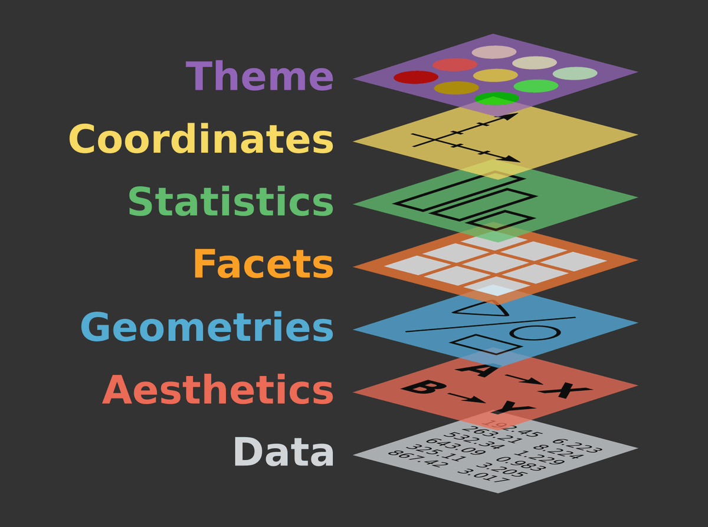

---
title       : Programación en R.
subtitle    : Módulo 04 - Visualización de datos.
framework   : io2012        # {io2012, html5slides, shower, dzslides, ...}
highlighter : highlight.js  # {highlight.js, prettify, highlight}
hitheme     : github      # tomorrow
widgets     : [mathjax, quiz, bootstrap, interactive] # {mathjax, quiz, bootstrap}
ext_widgets : {rCharts: [libraries/nvd3, libraries/leaflet, libraries/dygraphs]}
mode        : selfcontained # {standalone, draft}
knit        : slidify::knit2slides
logo        : 
biglogo     : Rlogo.png
assets      : {assets: ../../assets}
--- .class #id

<style type="text/css">
body {background:grey transparent;
}
</style>


<!-- Slide 01 -->

## Agenda del Curso
> * **Módulo 1: Introducción a la programación en R.**
  <ol>
    <ul style="list-style-type:square">
    <li> Ambiente de programación. </li>
    <li> Tipos de datos y estructuras de datos básicos. </li>
    <li> Control de flujo y funciones. </li>
    </ul>
  </ol> 

> * **Módulo 2: Manejo de datos estructurados.**
  <ol>
    <ul style="list-style-type:square">
    <li> Operaciones sobre dataframes. </li>
    <li> Joins y funciones estadísticas. </li>
    </ul>
  </ol> 

> * **Módulo 3: Importar y exportar archivos de datos.**
  <ol>
    <ul style="list-style-type:square">
    <li> Importar y exportar archivos de datos. </li>
    <li> Conexión a bases de datos SQL. </li>
    </ul>
  </ol> 

> * **Módulo 4: Visualización de datos.**
 <ol>
    <ul style="list-style-type:square">
    <li> Librería ggplot2 y elementos estéticos de gráficos. </li>
    </ul>
  </ol> 


<!-- Slide 02 -->

--- .segue bg:grey

# Módulo 4: Visualización de datos.

--- &twocol


<!-- Slide 03 -->
## Capas 

*** =left

* Las visualizaciones de `ggplot` se construyen paso a paso agregando nuevos
elementos, uno encima de otro, usando el operador `+`. 

* Estos nuevos elementos, son denominadas `capas`.

  * `Data` & `aesthetics.`
  * `Geometries.`
  * `Facets.`
  * `Statistics.`
  * `Coordinates.`
  * `Theme.`  

*** =right

</img>

Para utilizar esta librería, basta con cargarla como:
```{r, echo=TRUE, eval=TRUE, message=FALSE}
library("ggplot2")
```

*** =fullwidth


--- &twocol

<!-- Slide 03 -->
## Facets 

*** =left

* Las facetas o `Facets` es un enfoque que divide una trama
en una matriz de paneles. Cada panel muestra un subconjunto 
diferente de los datos.

* En `ggplot2`, las facetas se dividen en:
  * `facet_grid()`
  * `facet_wrap()`

* En gráficos de una sola variable, no existe una diferencia
entre usar `facet_grid()` ó `facet_wrap()`.

* Los ejemplos descritos, se encuentran en:

  <span class="footnote"> Código: [M4_C2_script01.R]() </span>

*** =right 
`Ejemplo 1`

```{r, eval=TRUE, echo=FALSE, message=FALSE}
library("ggplot2")
data("mpg")
```

```{r, eval=TRUE, echo=TRUE, fig.height = 6, fig.width = 8}
ggplot(data = mpg, aes(x = displ, 
  y = hwy)) + geom_point() + 
  facet_wrap(~cyl)
```

*** =fullwidth

--- &twocol

<!-- Slide 03 -->
## facet_wrap()

*** =left
`Ejemplo 2`

```{r, eval=TRUE, echo=TRUE, fig.height = 6, fig.width = 8}
ggplot(data = mpg, aes(x = displ, y = hwy)) + 
  geom_point(size = 2, alpha = 0.5) + 
  facet_wrap(~cyl)
```

*** =right 
`Ejemplo 3`

```{r, eval=TRUE, echo=TRUE, fig.height = 6, fig.width = 8}
ggplot(data = mpg, aes(x = displ, y = hwy, 
  color = drv)) + geom_point(size = 2, 
  alpha = 0.5) + facet_wrap(~cyl)
```

--- &twocol

<!-- Slide 03 -->
## facet_grid()

*** =left
`Ejemplo 4`
```{r, echo=FALSE, eval=TRUE}
data("ToothGrowth")
```

```{r, eval=TRUE, echo=TRUE, fig.height = 5, fig.width = 8}
ggplot(ToothGrowth, aes(x=dose, y=len, 
group=factor(dose))) + 
geom_boxplot(aes(fill=factor(dose))) +
facet_grid(supp ~ .)
```

*** =right 
`Ejemplo 5`

```{r, eval=TRUE, echo=TRUE, fig.height = 5 , fig.width = 8}
ggplot(ToothGrowth, aes(x=dose, y=len, 
group=factor(dose))) +
geom_boxplot(aes(fill=factor(dose))) + 
facet_grid(.~supp)
```

--- &twocol

<!-- Slide 03 -->
## Coordinates 

*** =left

* Coordenadas Lineales

  * `coord_cartesian()`
  
  * `coord_flip()`
  
  * `coord_fixed()`

* Coordenadas no Lineales 

 * `coord_map()`
 
 * `coord_polar()` 
 
 * `coord_trans()` 

* Los ejemplos descritos, se encuentran en:

  <span class="footnote"> Código: [M4_C2_script02.R]() </span>

*** =right 
`Ejemplo 6`

```{r, eval=TRUE, echo=TRUE, fig.height = 6, fig.width = 8, message = FALSE}
ggplot(mpg, aes(displ, hwy)) + 
  geom_point(size = 3, alpha = 0.7) + 
  geom_smooth()
```

--- &twocol

<!-- Slide 03 -->
## coord_cartesian()

*** =left
`Ejemplo 7`

```{r, eval=TRUE, echo=TRUE, fig.height = 5, fig.width = 8, message=FALSE, warning=FALSE}
ggplot(mpg, aes(displ, hwy)) + 
  geom_point(size = 3, alpha = 0.7) + 
  geom_smooth() + 
  scale_x_continuous(limits = c(4, 6))
```

*** =right 
`Ejemplo 8`

```{r, eval=TRUE, echo=TRUE, fig.height = 5 , fig.width = 8,message=FALSE, warning=FALSE}
ggplot(mpg, aes(displ, hwy)) + 
  geom_point(size = 3, alpha = 0.7) + 
  geom_smooth() + 
  coord_cartesian(xlim = c(4, 6))
```


--- &twocol

<!-- Slide 03 -->
## coord_flip()

*** =left
`Ejemplo 9`

```{r, eval=TRUE, echo=TRUE, fig.height = 5, fig.width = 8, message=FALSE, warning=FALSE}
ggplot(ToothGrowth, aes(x=dose, y=len, 
group=factor(dose))) + 
geom_boxplot(aes(fill=factor(dose))) 
```

*** =right 
`Ejemplo 10`

```{r, eval=TRUE, echo=TRUE, fig.height = 5 , fig.width = 8,message=FALSE, warning=FALSE}
ggplot(ToothGrowth, aes(x=dose, y=len, 
group=factor(dose))) +  coord_flip() +
geom_boxplot(aes(fill=factor(dose))) 
```

--- &twocol

<!-- Slide 03 -->
## coord_fixed()

*** =left
`Ejemplo 11`

```{r, eval=TRUE, echo=TRUE, fig.height = 5, fig.width = 8, message=FALSE, warning=FALSE}
ggplot(mtcars, aes(mpg, wt)) + 
geom_point() + 
coord_fixed(ratio = 1)
```

*** =right 
`Ejemplo 12`

```{r, eval=TRUE, echo=TRUE, fig.height = 5 , fig.width = 8,message=FALSE, warning=FALSE}
 
ggplot(mtcars, aes(mpg, wt)) + 
  geom_point() +  
  coord_fixed(ratio = 5)
```

--- &twocol

<!-- Slide 03 -->
## Theme 

*** =left

* Los temas o `theme` son capas que permiten personalizar aun más el gráfico que se 
quiere mostrar.

* El sistema de temas no afecta en cómo los datos son representados por `geom_*()`,
ó cómo son transformados por escalas. Es decir, los temas no cambian las 
propiedades perceptivas del gráfico, pero si ayudan a que el gráfico sea 
estéticamente mejor.

* Los ejemplos descritos, se encuentran en:

  <span class="footnote"> Código: [M4_C2_script03.R]() </span>

*** =right 
`Ejemplo 13`

```{r, eval=TRUE, echo=TRUE, fig.height = 5, fig.width = 8, message = FALSE}
ggplot(iris, aes(x=Sepal.Length, 
        y=Petal.Length, colour=Species)) + 
  geom_point(size=3) + ggtitle("Scatterplot") + 
  xlab("Petal Length (cm)") + 
  ylab("Sepal Length (cm)")
```

--- &twocol

<!-- Slide 03 -->
## Theme 

*** =left

* El sistema de `tematización` se compone de cuatro componentes 
principales:

  * Titulos, leyendas, ejes, etc.

  * Color, tamaño de fuente, etc.

  * Anula elementos predeterminados y crea unos más personalizados.

  * Temas completos.

* Los ejemplos descritos, se encuentran en:

  <span class="footnote"> Código: [M4_C2_script03.R]() </span>

*** =right 
`Ejemplo 14`

```{r, eval=TRUE, echo=TRUE, fig.height = 5, fig.width = 8, message = FALSE}
ggplot(mpg, aes(cty, hwy, 
          color = factor(cyl))) +
          geom_jitter() + 
          geom_abline(colour = "grey50", 
                          size = 2)
```

--- &twocol

<!-- Slide 03 -->
## labs()

*** =left

```{r, eval=TRUE, echo=FALSE, fig.height = 8, fig.width = 8, message=FALSE, warning=FALSE}
ggplot(mpg, aes(cty, hwy, color = factor(cyl))) +
  geom_jitter(size = 2) + 
  geom_abline(colour = "grey50", size = 2) + 
  labs(
    x = "Eje X",
    y = "Eje Y",
    colour = "Cylinders",
    title = "Titulo") +
  scale_colour_brewer()
```

*** =right 
`Ejemplo 15`

```{r, eval=FALSE, echo=TRUE}
ggplot(mpg, aes(cty, hwy, 
                color = factor(cyl))) +
  geom_jitter(size = 3) + 
  geom_abline(colour = "grey50", 
              size = 2) + 
  # Capa labs            
  labs(
    x = "Eje X",
    y = "Eje Y",
    colour = "Cylinders",
    title = "Titulo") +
  # Escala de Colores
  scale_colour_brewer()
```


--- &twocol

<!-- Slide 03 -->
## scale_colour_brewer()

*** =left

```{r, eval=TRUE, echo=FALSE, fig.height = 8, fig.width = 8, message=FALSE, warning=FALSE}
ggplot(mpg, aes(cty, hwy, color = factor(cyl))) +
  geom_jitter(size = 2) + 
  geom_abline(colour = "grey50", size = 2) + 
  labs(
    x = "Eje X",
    y = "Eje Y",
    colour = "Cylinders",
    title = "Titulo") +
  scale_colour_brewer(palette = "Set1")
```

*** =right 
`Ejemplo 16`

```{r, eval=FALSE, echo=TRUE}
ggplot(mpg, aes(cty, hwy, 
                color = factor(cyl))) +
  geom_jitter(size = 3) + 
  geom_abline(colour = "grey50", 
              size = 2) + 
  # Capa labs            
  labs(
    x = "Eje X",
    y = "Eje Y",
    colour = "Cylinders",
    title = "Titulo") +
  # Escala de Colores
  scale_colour_brewer(palette = "Set1")
```

--- &twocol

<!-- Slide 03 -->
## theme_minimal()

*** =left

```{r, eval=TRUE, echo=FALSE, fig.height = 8, fig.width = 8, message=FALSE, warning=FALSE}
ggplot(mpg, aes(cty, hwy, color = factor(cyl))) +
  geom_jitter(size = 2) + 
  geom_abline(colour = "grey50", size = 2) + 
  theme_minimal() + 
  labs(
    x = "Eje X",
    y = "Eje Y",
    colour = "Cylinders",
    title = "Titulo") +
  scale_colour_brewer(palette = "Set1")
```

*** =right 
`Ejemplo 17`

```{r, eval=FALSE, echo=TRUE}
ggplot(mpg, aes(cty, hwy, 
                color = factor(cyl))) +
  geom_jitter(size = 3) + 
  geom_abline(colour = "grey50", 
              size = 2) + 
  # Tema de fondo            
  theme_minimal() +             
  # Capa labs            
  labs(
    x = "Eje X",
    y = "Eje Y",
    colour = "Cylinders",
    title = "Titulo") +
  # Escala de Colores
  scale_colour_brewer(palette = "Set1")
```

--- &twocol

<!-- Slide 03 -->
## theme()

*** =left

```{r, eval=TRUE, echo=FALSE, fig.height = 8, fig.width = 8, message=FALSE, warning=FALSE}
ggplot(mpg, aes(cty, hwy, color = factor(cyl))) +
  geom_jitter(size = 2) + 
  geom_abline(colour = "grey50", size = 2) + 
  theme_minimal() + 
  labs(
    x = "Eje X",
    y = "Eje Y",
    colour = "Cylinders",
    title = "Titulo") + 
   theme(
    plot.title = element_text(face = "bold", size = 12),
    legend.background = element_rect(fill = "white", size = 4, colour = "white"),
    legend.justification = c(0, 1),
    legend.position = c(0, 1),
    axis.ticks = element_line(colour = "grey70", size = 0.2),
    panel.grid.major = element_line(colour = "grey70", size = 0.2),
    panel.grid.minor = element_blank()
  ) +
  scale_colour_brewer(palette = "Set1")
```

*** =right 

`Ejemplo 18`

El siguiente ejemplo, ilustra la visualización de datos con varias capas
aplicadas.

</img>


