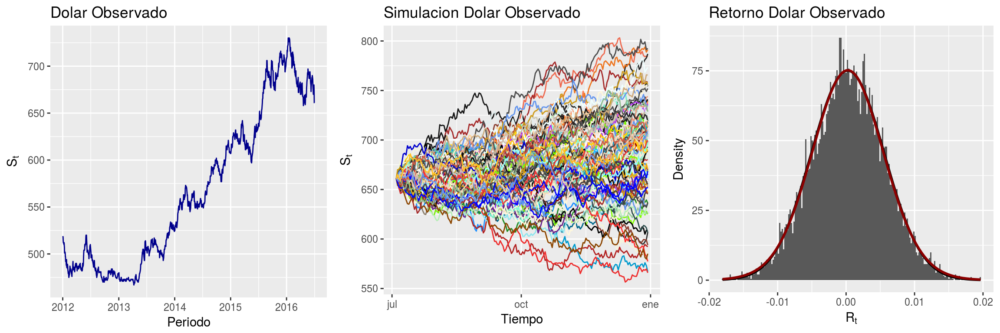

## 1. Entornos Gráficos.
`R` cuenta con distintos sistemas gráficos, aunque los más 
comunes son:

> **Sistema gráfico base de `R`**.
El core o núcleo gráfico de `R` se encuentra en los paquetes `graphics`
(contiene las funciones de gráficos base tal como `plot`, `hist`, etc) y
`grDevices` que implementa los distintos dispositivos gráficos como
`pdf`, `ps`, `png`, etc. 

> **Lattice** 
El paquete de complemento `Lattice` es una implementación de los gráficos 
de Trellis para `R`. Es un potente y elegante sistema de visualización de 
datos de alto nivel con énfasis en datos multivariables y es flexible de 
manipular.

> **ggplot2** 
La librería `ggplot2` es un paquete de visualización de datos para el 
lenguaje `R` que implementa lo que se conoce como la *Gramática de los 
Gráficos* (figura 1), que no es más que una representación esquemática 
y en capas de lo que se dibuja en dichos gráficos. Algunos ejemplos son los marcos, ejes, textos, títulos, datos o la información que se grafica, el tipo de gráfico que se utiliza, 
los colores, símbolos y tamaños, entre otros. 

{width=50%}

La instalación de `ggplot2` es bastante. Puede ser 
mediante el entorno gráfico de `RStudio` ó, a través de la consola con 
la instrucción: 

```{r, eval=FALSE, echo=TRUE}
install.packages("ggplot2", dependencies = TRUE)
```

De esta forma, nos aseguramos que `ggplot2` se instale con todas sus 
dependencias.

## 2. Capas de `ggplot2`. 

Un gráfico realizado con ggplot2 presenta, al menos, tres elementos:

{width=60%}

> **Datos** (`Data`) que queremos representar (que serán de tipo `dataframe`).

> **Características estéticas** (`aesthetic mappings`) que describen cómo 
queremos que los datos se vean en el gráfico. Para más información podemos 
consultar la vignette (`vignette("ggplot2-specs")`). Como luego veremos, 
se introducen con la función `aes()` y se refieren a; posición (en los ejes),
color exterior (`color`) y de relleno (`fill`), forma de puntos (`shape`),
tipo de línea (`linetype`), tamaño (`size`).

> **Objetos Geométricos** (`geom`) representan lo que vemos en un gráficos 
(puntos, líneas, etc.). Todo gráfico tiene, como mínimo, una geometría. 
La geometría determina el tipo de gráfico; `geom_point` (para puntos), `geom_line` 
(para lineas), `geom_histogram` (para histograma), `geom_boxplot` (para boxplot), 
`geom_bar` (para barras), `geom_smooth` (líneas suavizadas), `geom_polygons` 
(para polígonos en un mapa), etc. 

Por tanto, para construir un gráfico con `ggplot2` comenzamos con la siguiente 
estructura de código:


```{r, eval=TRUE, echo=TRUE, message=FALSE, out.width="50%", fig.align="center"}
library("ggplot2")
ggplot(data = iris)
```
En la línea anterior se crea un protográfico^[momento anterior al que el gráfico es fijado para siempre], esto quiere decir que 
contiene los datos que se utilizarán (`iris`). Obviamente, las líneas anteriores son 
insuficientes para crear un gráfico puesto que aún no hemos indicado qué 
queremos hacer con el conjunto de datos `iris`.

En la terminología de `ggplot2`, estéticas (`aesthetics`).  son, por ejemplo, 
la distancia horizontal o vertical, el color, la forma (de un punto), el 
tamaño (de un punto o el grosor de una línea), etc. Igual que al hablar, 
asociamos a un conjunto de sonidos (p.e., m-e-s-a) un significado (el objeto 
que conocemos como mesa), al realizar un gráfico asociamos a elementos sin
significado propio (p.e., los colores) uno: el que corresponde a una columna 
determinada de los datos.

En `ggplot2`, dentro del lenguaje de los gráficos que implementa, es 
muy importante esa asociación explícita de significados a significantes, 
es decir, de columnas de datos a estéticas.

```{r, eval=TRUE, echo=TRUE, message=FALSE, out.width="50%", fig.align="center"}
ggplot(data = iris) +
  aes(x = Sepal.Length, 
      y = Petal.Width, 
      colour = Species)
```
En la línea de código anterior, se están añadiendo a `ggplot(data = iris)`
información sobre las estéticas que tiene que utilizar y qué variables de 
`iris` tiene que utilizar:

* La coordenada horizontal, `x`, vendrá dada por `Sepal.Length`.
* La coordenada vertical, `y`, por `Petal.Width`.
* El `colour`, por `Species`.

## 3. `Geometries`. 

Las capas o `geom` para `ggplot2`, son los verbos del lenguaje de 
los gráficos. Indican qué hacer con los datos y las estéticas elegidas, 
cómo representarlos en un lienzo.

{width=50%}
{width=50%}

\newpage

### 3.1 `geom_point()`. 

La capa `geom_point()` se utiliza para crear diagramas de dispersión.
El diagrama de dispersión es más para mostrar la relación entre dos variables 
continuas. También se puede utilizar para comparar una variable continua y una 
categórica, o dos variables categóricas, pero con una variación como 
`geom_jitter()`, `geom_count()` o `geom_bin2d()` suele ser más apropiada.

La capa de `geom_point()`, tiene los siguientes argumentos básicos:

```{r, eval=FALSE, echo=TRUE}
ggplot(data, aes(x=x, y=y)) + 
  geom_point()
```

Donde *data* es un conjunto de datos del tipo dataframe, y *x* e *y* son las
relaciones que se intentan visualizar. Por ejemplo, utilizando el conjunto 
de datos `iris`, un diagrama de dispersión se presenta de la siguiente forma.

```{r, eval=TRUE, echo=TRUE, out.width="50%",fig.align="center"}
ggplot(data = iris, aes( x = Sepal.Length, y = Petal.Length)) + geom_point()
```

Cuando se desea visualizar varios gráficos en un mismo lienzo, la librería
que nos puede ayudar en esta implementación, es `gridExtra`. El siguiente 
ejemplo, presenta dos diagramas de dispersión en donde el primer gráfico,
se caracteriza por tener un número de puntos más grandes el cual, se 
controla mediante el argumento *size* y queremos que los puntos se diferencien
por el color de cada especie (argumento *colour*). El segundo gráfico es similar al anterior, 
pero además del tamaño de los puntos, diferenciaremos por el tipo de punto mediante el 
argumento *shape* que brinda tipos de puntos por categoría.


```{r, eval=TRUE, echo=TRUE, out.width="80%", fig.align="center", fig.width=10}
library("gridExtra")
# Plot 1
p0 <- ggplot(data = iris, 
             aes(x = Sepal.Length, 
                 y = Petal.Length, colour = Species)) + 
  geom_point(size = 3)

# Plot 2
p1 <- ggplot(data = iris, 
             aes(x = Sepal.Length, 
                 y = Petal.Length, 
                 colour = Species)) + 
  geom_point(size = 3, aes(shape=Species))

# Genera dos columnas con figuras anteriores
grid.arrange(p0, p1, ncol=2) 
```

Finalmente, para visualizar estos dos gráficos, utilizamos la función `grid.arrange()` para representar en dos columnas (*ncol* , *nrow* por defecto es uno) el gráfico final.

El siguiente ejemplo, es una versión alternativa a la anterior sólo con la diferencia que se 
introduce un nuevo argumento, *alpha*. En este caso, *alpha* controla el grado de translucidez de 
la capa `geom_point` la cual varía de 0 a 1. Mientras más cercano sean los valores a 1, el grado 
de translucidez desaparece.

```{r, eval=TRUE, echo=TRUE, out.width="80%", fig.align="center", fig.width=10}
p0 <- ggplot(data = iris, 
             aes(x=Sepal.Length, 
                 y=Petal.Length, 
                 group=Species)) +
  geom_point(aes(shape=Species, color=Species), size=3)

p1 <- ggplot(data = iris, 
             aes(x = Sepal.Length, 
                 y = Petal.Length, 
                 colour = Species)) + 
  geom_point(size = 3, alpha = 0.5)

grid.arrange(p0, p1, ncol=2)
```

Para mayor profundización de las funcionalidades adicionales que presenta `geom_point`, revisar la 
documentación oficial de `ggplot` en la siguiente dirección: https://ggplot2.tidyverse.org/reference/geom_point.html

\newpage

### 3.2 `geom_line()`. 
Los gráficos de línea se usan frecuentemente cuando hay una variable de datos
continuos ordenada secuencialmente, por ejemplo, las series de tiempo
(años, horas, minutos, o cualquier otra secuencia ordenada). 

La capa de `geom_line()`, tiene los siguientes argumentos básicos:

```{r, eval=FALSE, echo=TRUE}
ggplot(data, aes(x=x, y=y)) + 
  geom_line()
```

En donde las componentes *x* e *y* hacen referencia a una secuencia
de valores posicionados en el eje *y* en el instante *x*. La geometría
`geom_line()` muestra la evolución de éste.  

El siguiente ejemplo, presenta las tasas de desempleo de la economia de 
Estados Unidos (data `economics` de `ggplot2`). En el eje *y*
presenta la tasa como tal y en el eje *x* los períodos de tiempo.

```{r, eval=TRUE, echo=TRUE, out.width="50%",fig.align="center"}
data("economics")
ggplot(data = economics, aes(x=date, y=uempmed)) + geom_line() 
```

El siguiente ejemplo, ilustra algunos atributos adicionales a los gráficos 
de línea, como por ejemplo; *color*, *alpha*, *size*. Notar que estos mismos
atributos los vimos al visualizar gráficos de dispersión por lo que éstos
atributos son independiente de la capa que se utilice. 

El gráfico 1, visualiza la misma serie de desempleo anterior, pero ahora
se caracteriza por tener un grosor diferente controlado por el argumento *size*,
de color azul controlado por el argumento *color* y un grado de translucidez
medio controlado por el argumento *alpha*. El segundo gráfico, utilizamos un
conjunto de datos que no viene en el paquete `ggplot2` pero es muy famoso llamado
`gapminder`. Este conjunto viene por defecto en la libreria `dslabs`. En 
este gráfico, presentamos las expectativas de vida (años de vida) versus
el tiempo en años. Estas series, son por paises (`by`) y agrupados por color 
mediante la variable continent (`colour`).

```{r, eval=TRUE, echo=TRUE, out.width="80%", fig.align="center", fig.width=10}
library("dslabs")
p0 <- ggplot(data = economics, aes(x=date, y=uempmed)) +
  geom_line(size = 1.5, color = "blue", alpha = 0.5)

p1 <- ggplot(data = gapminder, aes(x=year, y=life_expectancy, by=country, colour=continent)) +
  geom_line()

grid.arrange(p0, p1, ncol=2)
```

Para mayor profundización de las funcionalidades adicionales que presenta `geom_line`, revisar la 
documentación oficial de `ggplot` en la siguiente dirección:
https://ggplot2.tidyverse.org/reference/geom_path.html


### 3.3 `geom_boxplot()`. 
Un diagrama de caja  o `boxplot`, es un diagrama que muestra de forma
compacta la distribución de una variable aleatoria continua. Visualiza
cinco estadísticos de resumen (mediana, dos bisagras y dos bigotes) y
todas las observaciones periféricas invididualmente. 

La capa de `geom_boxplot()`, tiene los siguientes argumentos básicos:

```{r, eval=FALSE, echo=TRUE}
ggplot(data, aes(x=x, y=y)) + 
  geom_boxplot()
```

El siguiente ejemplo, presenta un boxplot para visualizar la distribución
de precios por cada tipo de corte del conjunto de datos `diamonds` que viene
por defecto en `ggplot`. En el eje *y* presenta los precios, y en el eje 
*x* presenta los cortes como variable categórica.

```{r, eval=TRUE, echo=TRUE, out.width="50%",fig.align="center"}
ggplot(diamonds, aes(x=cut, y=price)) +
  geom_boxplot()
```

Uno de los atributos diferenciadores, en relación a las otras geometrías, es
la representación de datos atípicos u outliers que son propios en este tipo
de gráficos. Para visualizar este tipo de dato fuera de tendencia, se puede
activar mediante el argumento *outlier.color* asignando un color a este dato
atípico dentro de la capa `geom_boxplot`. 

\newpage

El siguiente ejemplo presenta dos boxplot que se diferencia al gráfico
anterior añadiendo marcadores de datos atípicos mediante el argumento
*outlier.color*, aumentando el tamaño de este mediante el argumento 
*outlier.size* y cambiando la forma o geometría de los puntos
mediante el argumento *outlier.shape*. Por otro lado, se rellenan las cajas
con colores de acuerdo a la variable categórica mediante el argumento
*fill*.

```{r, eval=TRUE, echo=TRUE, out.width="80%", fig.align="center", fig.width=10}
p0 <-  ggplot(diamonds, aes(x=cut, y=price, fill=cut)) + 
  geom_boxplot(outlier.colour = "red")

p1 <- ggplot(diamonds, aes(x=cut, y=price, fill=cut)) + 
  geom_boxplot(outlier.colour = "red", outlier.size = 1, outlier.shape = 16)
grid.arrange(p0, p1, ncol=2)
```

Una alternativa a los clasicos boxplot que conocemos son los graficos 
de violín que considera la densidad de los datos a visualizar. 
En ggplot, esta capa se encuentra bajo el nombre de `geom_violin` y 
hereda los mismos atributos de `geom_boxplot`. 

En el siguiente ejemplo, se presentan la diferencia entre un 
`geom_boxplot` y un `geom_violin` respectivamente. 

```{r, eval=TRUE, echo=TRUE, out.width="80%", fig.align="center", fig.width=10}
p0 <- ggplot(diamonds, aes(x=cut, y=price, fill=cut)) + geom_boxplot(notch=TRUE)
p1 <- ggplot(diamonds, aes(x=cut, y=price, fill=cut)) + 
  geom_violin()
grid.arrange(p0, p1, ncol=2)
```

A veces es útil sacar los outliers del gráfico. Para eso pueden usar el parámetro `outlier.shape = NA`. Pero esto simplemente evita que se impriman, pero no ajusta los ejes. Para ajustar los ejes pueden hacerlo a posteriori con `scale_y_continuous` o usar otras funciones de otros paquetes si quieren que el rango de ajuste se elija automáticamente. Eso queda propuesto al lector. A continuación hay un ejemplo de cómo eliminar outliers con `outlier.shape = NA` y `scale_y_continuous`.

```{r, eval=TRUE, echo=TRUE, out.width="80%", fig.align="center", fig.width=10}
n <- 1e4L
dfr <- data.frame(
  y = exp(rlnorm(n)),  #really right-skewed variable
  f = gl(2, n / 2)
)

p <- ggplot(dfr, aes(f, y)) + 
  geom_boxplot()
p   # big outlier causes quartiles to look too slim

p2 <- ggplot(dfr, aes(f, y)) + 
  geom_boxplot(outlier.shape = NA)
p2  # no outliers plotted

p3 <- ggplot(dfr, aes(f, y)) + 
  geom_boxplot(outlier.shape = NA) +
  scale_y_continuous(limits = quantile(dfr$y, c(0.1, 0.9)))
p3  # no outliers plotted, range shifted

```


Para mayor profundización de las funcionalidades adicionales que presenta 
`geom_boxplot`, revisar la documentación oficial de `ggplot` en la siguiente 
dirección: https://ggplot2.tidyverse.org/reference/geom_boxplot.html

### 3.4 `geom_histogram()`. 

`geom_histogram` permite visualizar la distribución de variables 
continuas dividiendo el eje *x* en bins y contando el número de 
observaciones en cada bins. Esta capa, muestra los recuentos 
con barras. Si se desea mostar los recuentos con líneas, se debe utilizar 
`geom_freqpoly()`, aunque son más adecuados cuando se desea comparar la 
distribución entre los niveles de una variable categórica. 

La capa de `geom_histogram()`, tiene los siguientes argumentos básicos:

```{r, eval=FALSE, echo=TRUE}
ggplot(data, aes(x=x)) + geom_histogram()
```

El siguiente ejemplo, presenta el histograma de la variable *carat* del conjunto
de datos *diamonds*. Dentro de la capa `geom_histogram` se puede controlar el número
de bins o quiebres mediante el argumento `bins`. 

```{r, eval=TRUE, echo=TRUE, out.width="50%",fig.align="center"}
ggplot(diamonds, aes(x=carat)) + geom_histogram(bins=30)
```

En el siguiente ejemplo, se muestra la diferencia entre utilizar `binwidth` y `bins` (por defecto,
es 30). La diferencia radica en que `binwidth` controla el ancho de la barra y `bins` el número 
de barras. Para el primer gráfico, indicaremos que queremos los histogramas con barras de ancho 0.5 y
para el gráfico dos, solo queremos que sea de color azul (`fill`) y con translucidez mediana (`alpha`).

```{r, eval=TRUE, echo=TRUE, out.width="80%", fig.align="center", fig.width=10, message=FALSE}
p0 <- ggplot(diamonds, aes(x=carat)) + geom_histogram(binwidth=0.05)
p1 <- ggplot(diamonds, aes(x=carat)) + geom_histogram(alpha=0.5, fill="blue")
grid.arrange(p0, p1, ncol=2)
```

Para mayor profundización de las funcionalidades adicionales que presenta 
`geom_histogram`, revisar la documentación oficial de `ggplot` en la siguiente 
dirección: https://ggplot2.tidyverse.org/reference/geom_histogram.html


### 3.5 `geom_density()`. 

Esta capa visualiza la estimación de la densidad de kernel, que es una versión 
suavizada del histograma. Esta es una alternativa útil al histograma para datos 
continuos que provienen de una distribución uniforme subyacente.

La capa de `geom_histogram()`, tiene los siguientes argumentos básicos:

```{r, eval=FALSE, echo=TRUE}
ggplot(data, aes(x=x)) +  geom_density()
```

En el siguiente ejemplo, se presentan dos gráficos de densidad. En el primero, 
se visualiza la densidad de la variable continua *cty* del conjunto de datos *mtcars*,
pero con un kernel gausiano (argumento *kernels*). En el segundo, se presenta el mismo 
gráfico anterior, pero se muestra la desegregación y el coloreado (argumentos *color* y *fill*) 
por la variable categórica *drv*, y que cada densidad tenga transparencia de 0.1 (argumento *alpha*) 

```{r, eval=TRUE, echo=TRUE, out.width="80%", fig.align="center", fig.width=10}
p0 <- ggplot(mpg, aes(x=cty)) + geom_density(kernel="gaussian")
p1 <- ggplot(mpg, aes(x=cty, color=drv, fill=drv)) + geom_density(alpha = 0.1)
grid.arrange(p0, p1, ncol=2)
```

Cabe destacar que en el segundo gráfico, la utilización de colores en las densidades, es para 
descomponer la variable  *cty* en las subcategorías de *drv*. En otras palabras, permite aperturar
la visualización en relación a diferentes variables. Ésta regla, no sólo aplica para los gráficos
de densidades, sino también a gráficos de histogramas, barplots, boxplots, entre otros.  

Para mayor profundización de las funcionalidades adicionales que presenta 
`geom_density`, revisar la documentación oficial de `ggplot` en la siguiente 
dirección: https://ggplot2.tidyverse.org/reference/geom_density.html

### 3.6 `geom_bar()`. 

`geom_bar()` permite visualizar el número de ocurrencias para cada categoría de la variable.
En este contexto, la altura de las barras representa el número de observaciones de una 
categoría discreta representada en el eje de $X$. La sintáxis para generar este tipo de
gráfico es bastante simple:

```{r, eval=F, echo=TRUE}
ggplot(data, aes(x=x)) + geom_bar()
```

El siguiente ejemplo, presenta cuatro diferentes tipos de gráficos de barras. En 
los dos primeros ejemplos, se visualiza en primera instancia, un gráfico de barra en su
forma más simple que consiste en contabilizar el número de ocurrencias de las categorías
de la variable `cut` del set de datos `diamond`. El segundo ejemplo, presenta un ligero
cambio en donde, además de contabilizar ocurrencias de la variable `cut`, genera un color de 
borde en cada barra.

```{r, eval=TRUE, echo=TRUE, out.width="80%", fig.align="center", fig.width=10}
data("diamonds")
p0 <- ggplot(diamonds, aes(cut)) + geom_bar()
p1 <- ggplot(diamonds) + geom_bar(mapping = aes(x = cut, colour = cut))
grid.arrange(p0, p1, ncol=2)
```

En el segundo grupo de gráficos, se presentan algunas variantes relacionados con los 
anteriores. En el tercer gráfico, se genera se  genera la diferencia en que el color,
ahora no sólo es en en los bordes de las barras, sino también están llenas del color
(argumento `fill`) asociado a cada categoría. El cuarto ejemplo ilustra 
la visualización de un gráfico de barra , contando eventos relacionados a la variable 
`cut`, pero generando un llenado de color por cada categoría de la variable `clarity`.

```{r, eval=TRUE, echo=TRUE, out.width="80%", fig.align="center", fig.width=10}
data("diamonds")
p0 <- ggplot(diamonds) + geom_bar(mapping = aes(x = cut, fill = cut))
p1 <- ggplot(diamonds) + geom_bar(mapping = aes(x = cut, fill = clarity))
grid.arrange(p0, p1, ncol=2)
```

Para mayor profundización de las funcionalidades adicionales que presenta 
`geom_density`, revisar la documentación oficial de `ggplot` en la siguiente 
dirección: https://ggplot2.tidyverse.org/reference/geom_bar.html

## 4. Facets

El uso de facetas o `facet` permite crear gráficos de paneles y 
controlar el cómo se relacionan las escalas de una panel con las
escalas de otro. 

Existen dos funciones principales para la creación de facetas.

 * `facet_grid`: Esta opción forma una matriz de gráficos por fila y columna por una variable seleccionada. 
  Es una opción que facilita ver los patrones cuando hay una combinación de dos variables discretas aún cuando
  no hallan observaciones asociadas a esas variables (es decir, presenta gráficos aún cuando estos, estén vacíos).

  * `facet_wrap`: sólo producirá gráficos para las combinaciones de variables 
  que si tienen valores.

Veamos estas diferencias en un ejemplo sencillo. Generaremos un `data.frame` artificial con algunas columnas. 

```{r, eval=TRUE, echo=TRUE}
df <- data.frame(
  equipo = c('A', 'A', 'A', 'A', 'B', 'B', 'B', 'B'),
  posicion = c('G', 'G', 'F', 'F', 'G', 'G', 'G', 'G'),
  puntos = c(8, 14, 20, 22, 25, 29, 30, 31),
  asistencias = c(10, 5, 5, 3, 8, 6, 9, 12))
```

```{r, eval=TRUE, echo=TRUE, out.width="80%", fig.align="center", fig.width=10}
p0 <- ggplot(df, aes(asistencias, puntos)) + geom_point() + facet_grid(posicion ~ equipo)
p1 <- ggplot(df, aes(asistencias, puntos)) + geom_point() + facet_wrap(posicion ~ equipo)
grid.arrange(p0, p1, ncol=2) 
```

Como se puede apreciar, cuando se utilizó `facet_grid`, presentó un panel vacío aún cuando éste,
no tenia observaciones asociadas a las variables posición y equipo, mientras que al usar `facet_wrap`, 
éste no muestra paneles vacíos. De acuerdo a la [documentación oficial](https://ggplot2.tidyverse.org/reference/facet_grid.html#:~:text=facet_grid()%20forms%20a%20matrix,many%20levels%2C%20try%20facet_wrap()%20) el uso entre `facet_grid` y `facet_wrap` radica en el contenido del conjunto de datos. Cuando
el set de datos contiene dos variables discretas y todas las combinaciones de estas variables existen, se recomienda
usar `facet_grid`, en cambio, si se tiene una variable con muchos niveles, se recomienda usar `facet_wrap`.

El siguiente ejemplo, presenta un diagrama de dispersión mediante 
`geom_point` de las variables *displ* y *hwy* del conjunto de datos *mpg*, y
este diagrama está con translucidez de 1/3 $\approx$ 33.3%. Sin embargo,
queremos que esta trama se represente en un panel con variables adicionales,
es decir, la cilindrada (*cyl*) y la clase (*class*). Es decir, se 
mostrará un panel de `geom_point` entre las variables *displ* y *hwy*
por cada combinación de *cyl* y *class*.

```{r, eval=TRUE, echo=TRUE, out.width="80%",fig.align="center"}
ggplot(mpg, aes(displ, hwy)) + 
  geom_point(alpha=1/3) + facet_wrap(cyl~class)
```


```{r, eval=TRUE, echo=TRUE, out.width="80%", fig.align="center", fig.width=10}
p0 <- ggplot(data = mpg, aes(x = displ, y = hwy)) + 
  geom_point() + 
  facet_wrap(~cyl)
  
p1 <- ggplot(data = mpg, aes(x = displ, y = hwy)) + 
  geom_point(size = 2, alpha = 0.5) + 
  facet_wrap(~cyl)
grid.arrange(p0, p1, ncol=2)  
```

Notar que `geom_facet` es solo una capa adicional a las anteriores, por lo que 
es independiente de la capa geométrica utilizada, aplica a `geom_histogram`,
`geom_density`, `geom_point`, `geom_boxplot`, etc. El siguiente ejemplo,
presenta en el primer gráfico un panel de diagramas de dispersión, coloreados
por la variable *drv* y los puntos son de tamaño 2 con translucidez de 0.5. Por
otro lado, el segundo gráfico, presenta un boxplot agrupado por la variable
*dose* y en un panel de la variable *supp*.

```{r, eval=TRUE, echo=TRUE, out.width="80%", fig.align="center", fig.width=10}
p0 <- ggplot(data = mpg, aes(x = displ, y = hwy, color = drv)) + 
  geom_point(size = 2, alpha = 0.5) + 
  facet_wrap(~cyl)

p1 <- ggplot(ToothGrowth, aes(x=dose, y=len, group=factor(dose))) + 
  geom_boxplot(aes(fill=factor(dose))) + 
  facet_grid(supp ~ .)

grid.arrange(p0, p1, ncol=2) 
```

Para mayor profundización de las funcionalidades adicionales que presenta 
`geom_facet`, revisar la documentación oficial de `ggplot` en la siguiente 
dirección: https://ggplot2.tidyverse.org/reference/facet_grid.html

## 5. Coordinates

Los sistemas de coordenadas se pueden clasificar en dos grupos: 

* Los sistemas de coordenadas lineales:

  * `coord_cartesian`: el sistema de coordenadas cartesianas por defecto, 
  donde la posición 2d de un elemento viene dada por la combinación de 
  las posiciones *x* e *y*.

  * `coord_flip()`: Sistema de coordenadas cartesianas con los ejes *x* e 
  *y* invertidos.

  * `coord_fixed`:  sistema de coordenadas cartesianas con una relación 
  de aspecto fija.

* Los sistemas de coordenadas no lineales:

  * `coord_map`: Proyecciones cartograficas.
  
  * `coord_polar`: Coordenadas polares.
  
  * `coord_trans`: Aplica transformaciones arbitrarias a las posiciones 
  *x* e *y*, después de que *stat* haya procesado los datos.


\newpage

Para visualizar las diferencias en la utilizacion de coordenadas, utilizaremos
este diagrama de dispersion.

```{r, eval=TRUE, echo=TRUE, out.width="50%",fig.align="center", message=FALSE}
ggplot(mpg, aes(displ, hwy)) + 
  geom_point(size = 3, alpha = 0.7) + 
  geom_smooth()
```

En el siguiente ejemplo, se presentan dos gráficos. El primero, presenta
el mismo gráfico anterior, pero esta vez, contiene una capa adicional que es 
`scale_x_continuous`. Lo que hace esta capa, es solo presentar el diagrama 
de dispersión con limites entre 4 a 6 en el eje *x*. Por otro lado, 
el segundo gráfico, solo hace la diferencia en utilizar `coord_cartesian` con los
mismos límites entre 4 y 6.  La principal diferencia entre ambas capas, es que 
con `coord_cartesian` es un efecto lupa no descartando los datos fuera de los 
limites especificados.


```{r, eval=TRUE, echo=TRUE, out.width="80%", fig.align="center", fig.width=10, warning=FALSE, message=FALSE}
p0 <- ggplot(mpg, aes(displ, hwy)) + 
  geom_point(size = 3, alpha = 0.7) + 
  geom_smooth() + 
  scale_x_continuous(limits = c(4, 6))
p1 <- ggplot(mpg, aes(displ, hwy)) + 
  geom_point(size = 3, alpha = 0.7) + 
  geom_smooth() + 
  coord_cartesian(xlim = c(4, 6))
grid.arrange(p0, p1, ncol=2) 
```

\newpage

La mayoría de los análisis estadísticos y *geoms* suponen que estamos 
interesados en los valores de *y* condicionales a los valores de *x* en la 
mayoría de los modelos estadísticos.  Suponen que los valores de *x* se miden 
sin error. Este ejemplo intenta mostrar los efectos visualizar la variable
*x* condicionado a *y* utilizando la capa `coord_flip` o rotación de 90 grados.

```{r, eval=TRUE, echo=TRUE, out.width="80%", fig.align="center", fig.width=10, warning=FALSE, message=FALSE}
p0 <- ggplot(mpg, aes(cty, displ)) + geom_point(size = 3, alpha = 0.7) + 
  geom_smooth()
p1 <- ggplot(mpg, aes(displ, cty)) + geom_point(size = 3, alpha = 0.7) + 
  geom_smooth() + coord_flip() 
grid.arrange(p0, p1, ncol=2) 
```

El siguiente ejemplo, muestra la utilidad de usar `coord_fixed`. Esta capa, fija la 
relación de longitud en los ejes *x* e *y*. El valor predeterminado de *ratio* 
garantiza que los ejes *x* e *y* tengan escalas iguales: es decir, 1 cm a lo largo 
del eje *x* representa el mismo rango de datos que 1 cm a lo largo del eje *y*. La 
relación de aspecto también se establecerá para garantizar que la asignación se 
mantenga independientemente de la forma del dispositivo de salida.

```{r, eval=TRUE, echo=TRUE, out.width="80%", fig.align="center", fig.width=10, warning=FALSE, message=FALSE}

p0 <- ggplot(mtcars, aes(mpg, wt)) + 
  geom_point() + 
  coord_fixed(ratio = 1)

p1 <- ggplot(mtcars, aes(mpg, wt)) + 
  geom_point() +  
  coord_fixed(ratio = 5)
grid.arrange(p0, p1, ncol=2)
```

## 6. Theme

El sistema de tematización o `theme` se compone de cuatro componentes principales:

* Los *theme elements* especifican los elementos que no son datos que 
se puede controlar. Por ejemplo, el elemento *plot.title* controla la 
apariencia del título de la trama; la marcas en el eje x mediante 
*axis.ticks.x*, la altura de las teclas en la leyenda *legend.key.height*, 
etc.

* Cada elemento está asociado con *element function* , que describe las propiedades visuales del elemento. Por ejemplo, *element_text()* establece 
el tamaño de fuente, el color y la cara de elementos de texto como 
*plot.title*.

* La función  *theme()* permite anular los elementos del tema 
predeterminado llamando a funciones de elementos, como *theme(plot.title = element_text(colour = "red"))*.

* *complete themes* o temas completos. Ejemplos como *theme_grey()* 
establecen todos los elementos del tema en valores diseñados para trabajar juntos en armonía.


```{r, eval=TRUE, echo=TRUE, out.width="80%", fig.align="center", fig.width=10, warning=FALSE, message=FALSE}
p0 <- ggplot(mpg, aes(cty, hwy, color = factor(cyl))) +
  geom_jitter() + 
  geom_abline(colour = "grey50", size = 2)

p1 <- ggplot(mpg, aes(cty, hwy, 
                color = factor(cyl))) +
  geom_jitter(size = 3) + 
  geom_abline(colour = "grey50", 
              size = 2) + 
  labs(
    x = "Eje X",
    y = "Eje Y",
    colour = "Cylinders",
    title = "Titulo") +
  scale_colour_brewer()

grid.arrange(p0, p1, ncol=2)
```
Notar que la función `grid.arrange` genera un panel de objetos ggplot que se ubican por posiciones entre 
filas y columnas. En el caso del ejemplo anterior, se visualiza los objetos *p0* y *p1* en dos columnas (*ncol=2*).
Además, el objeto *p1* es el mismo que *p0*, sin embargo difieren en los atributos de *theme*. En el caso de 
*p0* se está visualizando el conjunto de datos *mpg* mediante tres variables; *cty*, *hwy* y diferenciándolos por color
mediante la variable categórica *cyl*. La función `jitter` agrega las observaciones o puntos al tramado. Por otro lado
la función `abline` agrega una línea diagonal de color gris categorizado como *greys50* y tamaño 2 (*size*). El objeto
*p1* cambia en el argumento de `jitter` ya que agrega un tamaño específico de las observaciones (*size*=2). Además,
se agrega la capa `labs` que contiene los atributos para darle un contexto al gráfico (título del gráfico, nombre de 
los ejes, título de la barra de colores, etc.)

Para mayor profundización de las funcionalidades adicionales que presenta 
`theme`, revisar la documentación oficial de `ggplot` en la siguiente 
dirección: https://ggplot2.tidyverse.org/reference/theme.html

```{r, eval=TRUE, echo=TRUE, out.width="80%", fig.align="center", fig.width=10, warning=FALSE, message=FALSE}
p0 <- ggplot(mpg, aes(cty, hwy, 
                color = factor(cyl))) +
  geom_jitter(size = 3) + 
  geom_abline(colour = "grey50", 
              size = 2) + 
  labs(
    x = "Eje X",
    y = "Eje Y",
    colour = "Cylinders",
    title = "Titulo") +
  scale_colour_brewer(palette = "Set1")

p1 <- ggplot(mpg, aes(cty, hwy, 
                color = factor(cyl))) +
  geom_jitter(size = 3) + 
  geom_abline(colour = "grey50", size = 2) +
  theme_minimal() + 
  labs(
    x = "Eje X",
    y = "Eje Y",
    colour = "Cylinders",
    title = "Titulo") +
  scale_colour_brewer(palette = "Set1")

grid.arrange(p0, p1, ncol=2)
```

```{r, eval=TRUE, echo=TRUE, out.width="50%",fig.align="center"}
ggplot(mpg, aes(cty, hwy, color = factor(cyl))) +
  geom_jitter(size = 2) + 
  geom_abline(colour = "grey50", size = 2) + 
  theme_minimal() + 
  labs(
    x = "Eje X",
    y = "Eje Y",
    colour = "Cylinders",
    title = "Titulo") + 
  theme(
    plot.title = element_text(face = "bold", size = 12),
    legend.background = element_rect(fill = "white", size = 4, colour = "white"),
    legend.justification = c(0, 1),
    legend.position = c(0, 1),
    axis.ticks = element_line(colour = "grey70", size = 0.2),
    panel.grid.major = element_line(colour = "grey70", size = 0.2),
    panel.grid.minor = element_blank()) +
  scale_colour_brewer(palette = "Set1")
```
